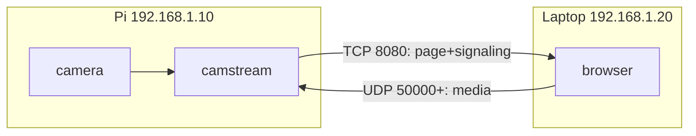
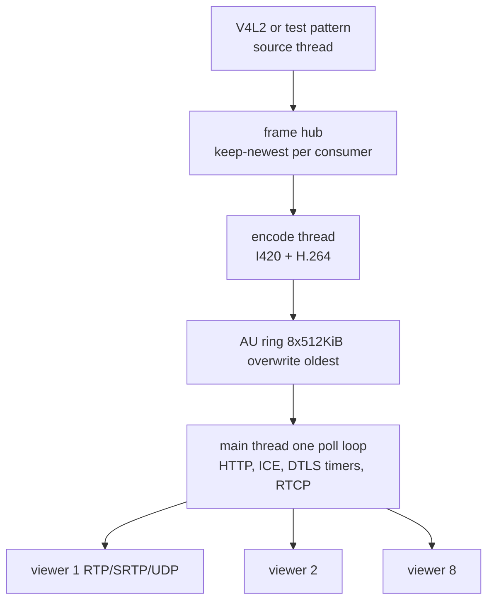
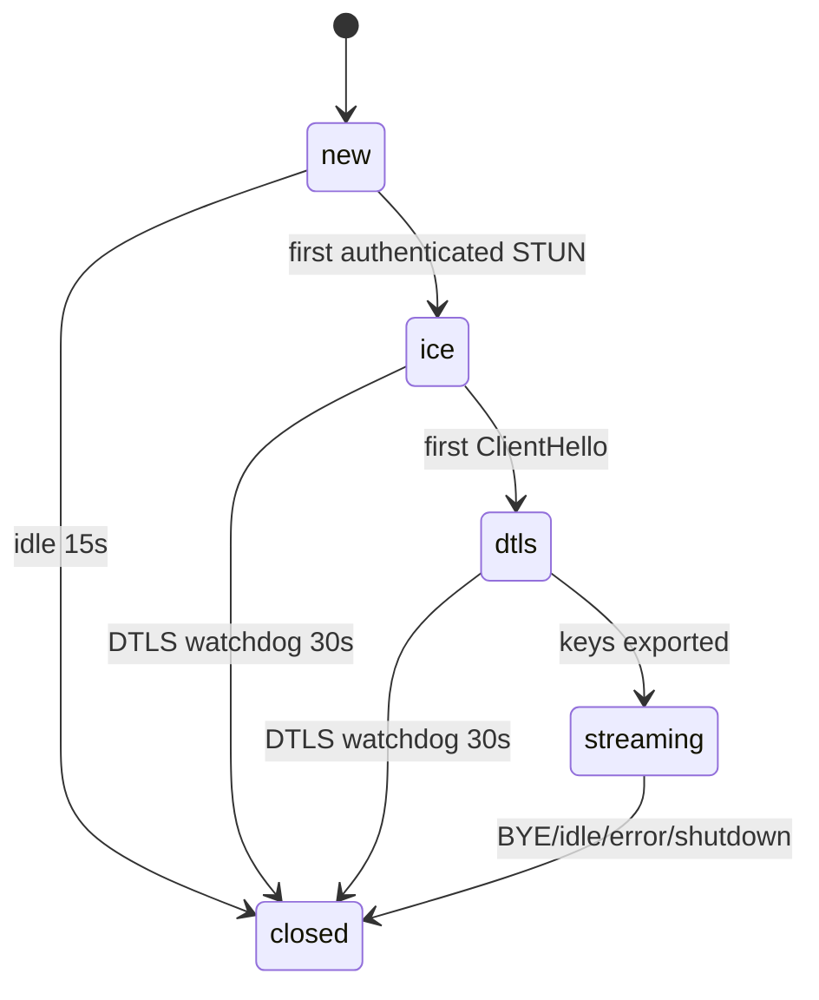

# camstream — Pure C WebRTC Camera Server + Minimal HTTP Server for Embedded Linux

> Turn any Linux box (Raspberry Pi, x86, ARM) with a V4L2 or CSI camera into a low-latency WebRTC camera that any browser can view — **no gateway, no cloud, no JavaScript build step**. Plus a 18-line portable HTTP static file server for embedded projects.

[](https://en.wikipedia.org/wiki/C_(programming_language))
[](https://www.raspberrypi.com/)
[](LICENSE)
[](#building)

**Project size:** ~18k lines of C across 50 files (+ libpeer vendored), plus vendored Mongoose HTTP server. Everything is native C — no Python/Node/Go runtime needed on the device.

---

## Contents

- [What is this?](#what-is-this)
- [Who is this for?](#who-is-this-for)
- [Features](#features)
- [Quick Start](#quick-start)
- [Raspberry Pi Compatibility — Verified](#raspberry-pi-compatibility--verified)
- [Components](#components)
  - [camstream (native WebRTC)](#camstream-native-webrtc)
  - [camstream-libpeer (libpeer WebRTC)](#camstream-libpeer-libpeer-webrtc)
  - [server.c — Minimal HTTP Server](#serverc--minimal-http-server)
- [Hardware](#hardware)
- [Building](#building)
- [Running](#running)
- [Configuration](#configuration)
- [Camera Setup](#camera-setup)
- [Networking Model](#networking-model)
- [Automatic LAN Connection (mDNS)](#automatic-lan-connection-mdns)
- [Web Interface](#web-interface)
- [Diagnostics API](#diagnostics-api)
- [Architecture Deep Dive](#architecture-deep-dive)
- [Camera Pipeline Explained](#camera-pipeline-explained)
- [WebRTC Flow Explained](#webrtc-flow-explained)
- [Latency & Performance](#latency--performance)
- [Security Model](#security-model)
- [Project Structure](#project-structure)
- [Testing](#testing)
- [Deployment (systemd)](#deployment-systemd)
- [Troubleshooting](#troubleshooting)
- [Known Limitations](#known-limitations)
- [Extending / Contributing](#extending--contributing)

---

## What is this?

A browser **cannot** consume a raw V4L2 camera (`/dev/video0`). You need something that:

1. Captures frames (V4L2 mmap, or Pi CSI via `rpicam-vid`)
2. Encodes H.264 (hardware V4L2 M2M `/dev/video11` or libx264)
3. Negotiates WebRTC (ICE-lite, DTLS 1.2, SRTP, RTP/RTCP)
4. Serves a web page and signaling over HTTP
5. Keeps alive when tabs close or Wi-Fi roams

`camstream` is that piece — **one binary, one process, pure C**.

It also includes:

- **`camstream-libpeer`**: same camera pipeline, but WebRTC via [sepfy/libpeer](https://github.com/sepfy/libpeer) — pure C, ARM/Linux target, ECDSA certs, so you can A/B latency.
- **`server.c`**: 18-line portable HTTP static file server (Mongoose single-file) — useful as standalone building block for any embedded Linux project. `gcc -O2 server.c mongoose.c -o web_server`.

---

## Who is this for?

- **Raspberry Pi camera projects** (IMX219, IMX477, IMX708) needing browser view with near-zero latency over Ethernet.
- **Embedded Linux** developers who want WebRTC without GStreamer, Janus, or Node.
- **Students / researchers** learning WebRTC internals in C (STUN, DTLS, SRTP, RTP packetization).
- **Anyone needing a tiny HTTP server** in C without containers — `server.c` is reusable.

---

## Features

- **Pure C, no runtime** — builds with `make`, runs on Pi OS, Debian, any Linux.
- **Two WebRTC stacks** in one repo:
  - Native: ICE-lite, DTLS 1.2 self-signed P-256, SRTP AES128_CM_SHA1_80, RTP/RTCP, NACK retransmit cache (512 packets), Sender Reports.
  - libpeer: same pipeline, one thread per viewer, STUN consent checks (2s/10s), FU-A reassembly, IDR-gated start.
- **Camera pipeline**: V4L2 mmap, CSI via `rpicam-vid` pipe (handles 64-byte stride padding), stdin YUV420, synthetic test pattern. Frame pool (refcounted, no alloc in loop), hub (keep-newest mailbox), AU ring (8×512 KiB overwrite oldest).
- **Encoder**: auto → hardware V4L2 M2M (`/dev/video11` on Pi Zero2/3/4) → libx264 `superfast/zerolatency` sliced threads (up to 4 cores, no latency). VBV CBR-like, fixed GOP, SPS/PPS on every IDR.
- **HTTP + mDNS**: Mongoose embedded, page embedded at build time, `camstream.local` via mDNS responder (probes, rename to `-2..-10` on conflict).
- **Diagnostics**: `/api/status`, `/api/stats`, `/api/logs`, pipeline layers, per-session RTT/loss/jitter, capture/encode FPS, CPU%.
- **Recovery**: camera/encoder watchdog, automatic rebuild with backoff 5s→60s, HW→SW fallback.
- **Minimal HTTP server**: 177 KB binary (`-O2`), 163 KB with `-DMG_ENABLE_LOG=0`, serves `./web_root`.

---

## Quick Start

### Native WebRTC (Pi CSI)

```sh
sudo apt update && sudo apt install -y build-essential libssl-dev libsrtp2-dev libx264-dev rpicam-apps
git clone https://github.com/ccsalman545/cam.git camstream && cd camstream
make -j4
sudo systemctl stop camstream  # if installed
./build/camstream --source csi --width 1280 --height 720 --fps 30 --encoder auto --listen 0.0.0.0 --http-port 8080
# open http://<pi-ip>:8080/ on same LAN, type http:// explicitly
```

### Libpeer Variant

```sh
git submodule update --init --recursive
sudo apt install -y cmake python3-jsonschema python3-jinja2
make camstream-libpeer -j4
./build/camstream-libpeer --source csi --width 1280 --height 720 --fps 30 --listen 0.0.0.0 --http-port 8080
```

### Minimal HTTP Server (standalone)

```sh
# mongoose.c/h are symlinks to third_party/mongoose/ — satisfies requested command
gcc -O2 -Wall server.c mongoose.c -o web_server
mkdir -p web_root && echo "hello Pi" > web_root/index.html
./web_server
# http://0.0.0.0:8000 serving ./web_root
curl http://127.0.0.1:8000/
```

---

## Raspberry Pi Compatibility — Verified

**This repo is Pi-first.** See [docs/RASPBERRY_PI.md](docs/RASPBERRY_PI.md) for full guide.

- **Minimal server `server.c`**: cross-compiled to **ELF AArch64 (EM 183)**, 145 KB optimized, curl 200 verified. Pure C, only libc, works on Pi OS Lite.
- **camstream native**: 0 warnings, 8 tests pass, V4L2 M2M `/dev/video11` HW encoder on Pi 0-4, auto fallback to libx264 on Pi 5, CSI via `rpicam-vid` pipe handling 64-byte stride.
- **camstream-libpeer**: native 5.5 MB, 2 tests pass (FU-A reassembly 3582 byte IDR, STUN consent 2s/10s), libpeer.a cross-compiles to AArch64.
- **No x86 intrinsics**, no container, systemd units with `SupplementaryGroups=video`.

Quick Pi setup:

```sh
sudo apt install -y build-essential libssl-dev libsrtp2-dev libx264-dev rpicam-apps
make -j4 && ./build/camstream --source csi --width 1280 --height 720 --fps 30 --listen 0.0.0.0 --http-port 8080
```

---

## Components

### camstream (native WebRTC)

- **Binary**: `build/camstream`
- **Stack**: in-house ICE-lite, DTLS, SRTP, RTP/RTCP (OpenSSL + libsrtp2)
- **Ports**: TCP 8080 (HTTP+signaling), UDP 50000-50007 (one per viewer), UDP 5353 (mDNS)
- **Viewers**: up to 8, one UDP socket each, same encoded stream
- **Pros**: single thread for all viewers (no locks), full control, detailed stats

### camstream-libpeer (libpeer WebRTC)

- **Binary**: `build/camstream-libpeer`
- **Stack**: [sepfy/libpeer](https://github.com/sepfy/libpeer) pinned at `5b849de`, vendored mbedtls/libsrtp2/usrsctp/cJSON
- **Why separate binary?** Different code paths for same protocols — easy A/B, fallback, comparison. No OpenSSL system dep needed.
- **Architecture**:
  ```
  camera -> source thread -> frame_hub -> encoder thread (single slice) -> AU ring
                                                          |
  media thread (poll AU ring, fan-out)
     -> one session thread per viewer (PeerConnection, DTLS, SRTP, RTP)
  ```
- **Key details**:
  - Encoder opened with `H264_ENCODER_SINGLE_SLICE` — libpeer treats each slice as a frame (marker+timestamp per slice). Single slice = 1 thread, no latency. HW encoder always single slice.
  - Signaling: Pi offers, browser answers. Candidates **inside answer** (libpeer only pairs while applying remote desc).
  - SDP sanitizer `lp_sdp.c` protects libpeer's fixed buffers (foundation 32, address 45, etc.) — validates CRLF, line length 250, fingerprint sha-256 uppercased, only UDP/IPv4 or `.local` mDNS, max 8 candidates.
  - Browser client `web/libpeer.html`: waits gathering complete, `jitterBufferTarget=0`, `playoutDelayHint=0`, shows delay = jitter+decode+RTT/2.
- **Build quirk**: upstream `config.h` defines `CONFIG_MTU` without `#ifndef`. Test receiver uses forced include `tests/libpeer_rx_config.h` → 1500 bytes (room for SRTP tag). Browsers unaffected.

### server.c — Minimal HTTP Server

**Why useful?** Every embedded project needs to serve files. This is **18 lines**, one dependency, no container.

- **File**: `server.c` at repo root
- **Dep**: `mongoose.c` + `mongoose.h` (single-file, 1.2M + 223K, MIT)
- **Build**: `gcc -O2 -Wall server.c mongoose.c -o web_server`
- **Run**: `./web_server` → `http://0.0.0.0:8000` serving `./web_root`
- **Size**: 177K (`-O2`), 163K (`-DMG_ENABLE_LOG=0 -s`)
- **Portable**: Linux, Pi, any POSIX — only libc.
- **Reusable**: copy `server.c` + `mongoose.c/h` + `web_root/` to any project. Change `root_dir` to your folder.

```c
#include "mongoose.h"
static void ev_handler(struct mg_connection *c, int ev, void *ev_data) {
  if (ev == MG_EV_HTTP_MSG) {
    struct mg_http_serve_opts opts = {.root_dir = "./web_root"};
    mg_http_serve_dir(c, (struct mg_http_message *) ev_data, &opts);
  }
}
int main(void) {
  struct mg_mgr mgr; mg_mgr_init(&mgr);
  mg_http_listen(&mgr, "http://0.0.0.0:8000", ev_handler, NULL);
  for (;;) mg_mgr_poll(&mgr, 1000);
}
```

---

## Hardware

| Device | Camera | Encoder | Notes |
|---|---|---|---|
| Pi Zero 2 / 3 / 4 | CSI IMX219/477/708 via `rpicam-vid` | HW `/dev/video11` (bcm2835-codec) | Best latency, low CPU |
| Pi 5 | Same CSI | No HW H.264 block → libx264 | Use `--encoder sw` |
| x86 / any Linux | USB V4L2 `/dev/video0` | libx264 | Test with `--source v4l2` |
| No camera | `--test` synthetic pattern | libx264 | For CI / dev |

---

## Building

### Dependencies

| Dep | For | Debian package |
|---|---|---|
| OpenSSL 1.1.1/3.x | DTLS for native | `libssl-dev` |
| libsrtp2 | SRTP for native | `libsrtp2-dev` |
| libx264 | SW encoder (both) | `libx264-dev` |
| cmake, python3-jsonschema, jinja2 | Build libpeer (mbedtls gen) | `cmake python3-jsonschema python3-jinja2` |
| pthreads, libm | Threads, math | libc |
| kernel headers | V4L2 ioctls | `linux-libc-dev` |
| rpicam-apps | CSI | `rpicam-apps` |

`camstream-libpeer` **does not need** OpenSSL/libsrtp2 — libpeer vendors mbedtls/libsrtp2.

### Targets

| Target | Effect |
|---|---|
| `make` | `build/camstream` |
| `make camstream-libpeer` | `build/camstream-libpeer` (needs submodule + cmake) |
| `make test` | Native stack tests (8) |
| `make test-libpeer` | Libpeer tests (SDP sanitizer + full flow) |
| `make install` | Install camstream + config + systemd |
| `make install-libpeer` | Install camstream-libpeer + unit |
| `make clean` | Remove `build/` |
| `make help` | List |

`make` searches `DEPS_PREFIX`, then `/usr/local`, then `/usr` — no pkg-config needed (Pi images often lack it).

```sh
make DEPS_PREFIX=/opt/cam        # all deps under one prefix
make X264_DIR=/opt/x264
make HAVE_X264=0                 # without SW encoder
make OPT="-O3 -march=armv8-a"
```

### Cross Compile for Pi 4 (aarch64) from x86_64

Zig provides `zig cc` cross toolchain:

```sh
pip install ziglang  # gives zig cc
make camstream-libpeer CMAKE=cmake \
  LIBPEER_CMAKE_ARGS="-DCMAKE_TOOLCHAIN_FILE=cmake/zig-aarch64.cmake" \
  CC="zig cc -target aarch64-linux-gnu"
```

Toolchain file at `cmake/zig-aarch64.cmake` sets `CMAKE_C_COMPILER` to `zig cc`.

### Minimal HTTP Server Only

No OpenSSL, no libsrtp2, no cmake needed:

```sh
gcc -O2 -Wall server.c mongoose.c -o web_server
```

---

## Running

```sh
# Test pattern — quickest check, no camera
./build/camstream --test
./build/camstream-libpeer --test -W 640 -H 480 -F 30

# USB camera
./build/camstream --source v4l2 --device /dev/video0 --width 1280 --height 720

# Pi CSI, HW encoder when available
./build/camstream --source csi --width 1280 --height 720 --fps 30 --encoder auto --listen 0.0.0.0 --http-port 8080
./build/camstream --source csi --width 1280 --height 720 --fps 30 --encoder sw --listen 0.0.0.0 --http-port 8080

# Libpeer variant (UDP range unused, ephemeral per viewer)
./build/camstream-libpeer --source csi --width 1280 --height 720 --fps 30 --encoder auto --listen 0.0.0.0 --http-port 8080

# From config file (enables POST /api/config/reload)
./build/camstream --config /etc/camstream.conf
```

Stop service first if installed (`sudo systemctl stop camstream`), else port 8080 busy.

Open `http://camstream.local:8080/` or `http://<pi-ip>:8080/` — **type `http://` explicitly**. Server speaks plain HTTP only; browsers forcing `https://` get `PR_END_OF_FILE_ERROR`. Server replies with TLS alert and logs `TLS handshake on plain HTTP port`.

### CLI Options (both camstream binaries)

| Option | Default | Meaning |
|---|---|---|
| `-s, --source KIND` | `v4l2` | `v4l2`, `csi`, `stdin`, `test` |
| `-d, --device PATH` | `/dev/video0` | V4L2 device |
| `-t, --test` | off | Shorthand for `--source test` |
| `--stdin-yuv420` | off | `--source stdin` |
| `--rpicam-bin PATH` | autodetect | `rpicam-vid` binary |
| `-W, --width N` | 640 | Capture width |
| `-H, --height N` | 480 | Height |
| `-F, --fps N` | 30 | FPS |
| `-e, --encoder MODE` | `auto` | `auto`, `hw`, `hw:/dev/videoN`, `sw` |
| `-b, --bitrate KBPS` | 2500 | Target bitrate |
| `-K, --keyframe SEC` | 2 | IDR interval |
| `-l, --listen ADDR` | `0.0.0.0` | HTTP bind |
| `-p, --http-port N` | 8080 | HTTP port |
| `-u, --udp-port N` | 50000 | First UDP media port (native only) |
| `-n, --mdns-name NAME` | `camstream` | Published as `NAME.local` |
| `--mdns on|off` | on | mDNS responder |
| `--mdns-port N` | 5353 | Responder port |
| `--config PATH` | none | Config file |
| `-v, --verbose` | off | DEBUG to stderr + `/api/logs` |

Exits 0 on SIGINT/SIGTERM after closing sessions, stopping threads, freeing DTLS.

---

## Configuration

Config file = CLI equivalents, `key = value`, unknown/out-of-range → refuse to start:

```ini
source = csi
device = /dev/video0
width = 1280
height = 720
fps = 30
encoder = auto
bitrate_kbps = 2500
keyframe_seconds = 2
listen = 0.0.0.0
http_port = 8080
udp_port = 50000
mdns = on
mdns_name = camstream
mdns_port = 5353
verbose = 0
```

`config/camstream.conf` is commented sample, installed to `/etc/camstream.conf`.

`POST /api/config/reload` re-reads file:

- Live: `bitrate_kbps` (queued to encode thread)
- Needs restart: `source`, `device`, `width`, `height`, `fps`, `encoder`, ports, `listen`, `mdns`, `mdns_name`, `mdns_port`

Response lists applied vs restart_required. File error → reload refused, running config untouched.

---

## Camera Setup

**USB:**
```sh
ls /dev/video* && v4l2-ctl --list-devices
v4l2-ctl -d /dev/video0 --list-formats-ext
./build/camstream --source v4l2 --device /dev/video0
# if not root: sudo usermod -aG video $USER && re-login
```

**Pi CSI:**
```sh
sudo apt install -y rpicam-apps
rpicam-hello --list-cameras
rpicam-vid -t 2000 -n --width 1280 --height 720 --codec yuv420 -o /dev/null
./build/camstream --source csi --width 1280 --height 720 --fps 30
```

Do **not** use `--source v4l2 --device /dev/video0` for CSI — sensor's `/dev/video0` is raw Bayer, needs libcamera graph, fails with errno 22. Use `csi`.

**Test pattern:**
```sh
./build/camstream --test --encoder sw
```

---

## Networking Model

LAN only by design — no STUN/TURN/cloud.



| Port | Proto | Dir | Purpose |
|---|---|---|---|
| 8080 | TCP | browser→server | Web UI, `/api/*`, signaling |
| 50000-50007 | UDP | browser→server | STUN, DTLS, SRTP (native, one per viewer) |
| ephemeral | UDP | server (libpeer) | One per viewer, libpeer binds |
| 5353 | UDP | both | mDNS `224.0.0.251` |

Browser needs `RTCPeerConnection`, DTLS 1.2, H.264 — all modern browsers qualify. Page served over plain HTTP is fine (only receives video, no `getUserMedia` → no HTTPS requirement).

---

## Automatic LAN Connection (mDNS)

- **Name**: `camstream.local` published via mDNS responder, re-announced on address change. Log and `/api/status` show it, footer shows `mdns.url`. Fallback: `/api/status` lists every non-loopback IPv4 + interface, `hostname -I`, `ip -4 addr`.
- **Page auto-connect**: muted video, no audio track → autoplay without click. Connect button for manual, Disconnect stops retries. Failed attempts retried 5× with backoff.
- **Boot**: `sudo make install && sudo systemctl enable --now camstream`.
- **Single cable Pi↔Laptop**: no DHCP → both fallback to link-local `169.254.0.0/16`, mDNS works over same cable.

Pi OS Bookworm (NetworkManager) link-local tuning:

```sh
nmcli con show
sudo nmcli con mod "Wired connection 1" ipv4.method auto ipv4.link-local enabled ipv4.dhcp-timeout infinity
sudo nmcli con up "Wired connection 1"
ip -4 addr show dev eth0
```

**mDNS clients:**

| Client | Support |
|---|---|
| macOS, iOS | Built-in |
| Win 10 1809+, Win 11 | Built-in |
| Linux systemd-resolved | `resolvectl mdns eth0 yes` |
| Linux avahi | `avahi-daemon` + `libnss-mdns` |
| Android 12+ | Built-in |

Two cameras: set different `mdns_name` (`porch`), else responder probes and renames to `camstream-2..-10`.

---

## Web Interface

`web/index.html` (native) and `web/libpeer.html` (libpeer) — plain HTML/CSS/JS, embedded at build time via `tools/embed_assets.c`, no drift.

- Video, connection state (`streaming` only when `video` element plays decoded frames)
- Pipeline layers panel
- Camera/encoder state (codec, resolution, capture/encode FPS, bitrate)
- Transport counters (packets, bytes, retransmits, NACKs, PLIs, RTT, loss)
- CPU/memory, server log with level filter
- Buttons: Connect/Disconnect, camera restart, WebRTC restart, config reload
- Footer: addresses, UDP range, HTTP port, `mdns.url`

Uses `RTCPeerConnection` with `iceServers: []`, `fetch()` for API, no framework.

---

## Diagnostics API

| Method | Path | Purpose |
|---|---|---|
| GET | `/` | Web UI |
| GET | `/api/status` | Subsystem state, counters, interfaces, rates |
| GET | `/api/stats` | Transport, per-session |
| GET | `/api/logs` | Ring `?limit=1..256&level=debug|warn|info|error` |
| POST | `/api/webrtc/offer` | Signaling `{"sdp":"..."}` (native) |
| POST | `/api/webrtc/close` | Close `{"session_id":N}` |
| POST | `/api/webrtc/client-stats` | Page reports `frames_decoded` |
| POST | `/api/camera/restart` | Rebuild pipeline |
| POST | `/api/webrtc/restart` | Drop sessions, new DTLS cert |
| POST | `/api/config/reload` | Re-read config |
| POST | `/api/session` | Create libpeer session → `{"id":N,"sdp":"..."}` |
| POST | `/api/session/answer` | Answer libpeer `{"id":N,"sdp":"..."}` |
| POST | `/api/session/close` | Close libpeer |

Unknown → 404 JSON, method → 405, malformed → 400 with reason.

`/api/status` reports: `state` (`idle`, `connecting`, `no-media`, `sending`, `streaming`, `camera-error`), `http` (bound, connections, TLS rejected), `source`, `encoder` (name, kind, bitrate, frames, keyframes, `idle|ok|stalled|failed`), `pipeline` (running, error, retry), `layers`, `webrtc` (DTLS fingerprint, handshake counters), `media` (FPS, bitrate, dropped), `process` (CPU%, RSS), `interfaces`, `config_file`, `last_error`.

`/api/stats` adds RTP totals and per-session: ICE peer/signaling peer, payload type, profile-level-id, frames sent/held, last media/RR age, `framesDecoded`, RTT, loss, jitter, STUN counters.

```sh
curl -s http://192.168.1.10:8080/api/status | python3 -m json.tool
curl -s 'http://192.168.1.10:8080/api/logs?limit=20&level=warn'
curl -s -X POST http://192.168.1.10:8080/api/camera/restart
```

No endpoint executes shell, opens file by name, or restarts process — 4 POSTs are whole state-changing set.

---

## Architecture Deep Dive

Two binaries share camera pipeline; control path owns async.



**Why one loop (native)?** LAN has 1 operator, up to 8 viewers, per-packet few µs, single thread removes locks between packetization, retransmit, RTCP.

**Data flow:**

1. Source thread fills pooled frame, `CLOCK_MONOTONIC` timestamp, publishes to hub, waits next slot. Hub keeps newest per consumer → slow encoder drops, not buffers (latency would accumulate here otherwise).
2. Encoder thread YUYV/YU12→I420, Annex B H.264, pushes AU + pts into ring. Ring overwrites oldest → encoder never blocks on network.
3. Main thread drains ring, splits AU into RTP (single NAL or FU-A ≤1200 UDP), SRTP encrypt, sends per viewer.
4. Retransmit cache 512 protected packets — RTCP NACK → resend cached bytes, not stall.
5. Sender Reports every 1s with NTP wall-clock → browser RTT, shallow jitter buffer. Mid-GOP join → IDR request (rate limited 400ms/session).

**Libpeer variant:** same up to AU ring, then media thread fan-out → one session thread per viewer (owns PeerConnection, DTLS, SRTP). Mailbox 8 slots, flushed on overflow with resync flag → never builds delay, resumes on next IDR. First NAL must be SPS.

---

## Camera Pipeline Explained

| Source | How | Use |
|---|---|---|
| `v4l2` | Opens device, negotiates YUYV→YU12, 4 mmap buffers | USB |
| `csi` | Spawns `rpicam-vid --codec yuv420 --flush -o -` pipe | Pi CSI |
| `stdin` | Raw YUV420 from stdin | `ffmpeg ... -f rawvideo -pix_fmt yuv420p -` |
| `test` | Synthetic pattern | Bench, no HW |

**CSI chain:**
```
IMX219 -> libcamera ISP -> rpicam-vid --codec yuv420 -o - -> pipe -> camstream -> H.264 -> RTP/SRTP -> browser
```

`rpicam-vid` pads luma rows to 64 bytes (chroma 32) — source reports stride, encoder strips padding. Even widths work, 640/1280/1920 avoid extra copy. Child started `posix_spawn`, CLOEXEC all fds, 1 MB pipe, `LIBCAMERA_LOG_LEVELS=*:WARN` unless verbose. EOF/dead child/truncated/5s no data (15s first frame) → pipeline rebuild.

**Encoders:**

| Mode | Backend | Notes |
|---|---|---|
| `auto` | HW first, then SW, plus runtime HW→SW switch | Default |
| `hw` | V4L2 M2M `/dev/video11` first, then any M2M | Pi Zero2/3/4 |
| `hw:/dev/video11` | Explicit | Unusual numbering |
| `sw` | libx264 | Pi 5 needs this |

libx264: `superfast`, `zerolatency` (no lookahead, no B-frames), sliced threads (1 per core max 4, no latency vs frame threads), constrained baseline, CBR-like VBV (max=target, buffer=0.5s), fixed GOP, SPS/PPS on every IDR.

HW backend fix: previous left capture H.264 format at 0×0 — bcm2835 accepts at `S_FMT`, rejects at port enable → `STREAMON` EAGAIN (errno 11). Fixed to real size, retries EAGAIN/EBUSY 3× before fallback.

Encoder runs only while viewer connected — with no viewer source keeps running (status still reports), encoder counts `skipped_idle` → warm camera, idle CPU.

---

## WebRTC Flow Explained

For beginners: WebRTC needs signaling (SDP exchange) over HTTP, then ICE (STUN) to find path, DTLS handshake to authenticate and derive SRTP keys, then SRTP media.



**Native:**

1. Browser loads `/`, creates receive-only video transceiver, POST offer to `/api/webrtc/offer`.
2. Server parses offer (ICE ufrag/pwd, fingerprint, H264 PT, mid, setup), binds UDP port, answers with `a=ice-lite`, `a=setup:passive`, host candidates per local IPv4, DTLS fingerprint (self-signed P-256 regenerated per start, rotated via `/api/webrtc/restart`).
3. ICE: ICE-lite — never sends checks, waits browser STUN binding request, verifies MESSAGE-INTEGRITY, answers XOR-MAPPED-ADDRESS, locks session to source address. Roaming → re-lock on new authenticated check.
4. DTLS 1.2 passive, self-signed P-256 in memory never on disk. Verifies peer cert vs fingerprint in offer, browser verifies server via answer. Media only after both authenticated.
5. SRTP `AES128_CM_SHA1_80`, keys from `EXTRACTOR-dtls_srtp`. Moves to `streaming` only after handshake and only if peer negotiated `use_srtp`; else refused. First keyframe requested immediately.

**Libpeer:** Pi offers, browser answers, candidates inside answer. Same DTLS/SRTP but per-viewer thread, ECDSA cert per viewer (ms), consent checks.

Ports: one UDP per session (native 50000-50007, libpeer ephemeral) bound at create, closed at end — idle server listens TCP only.

---

## Latency & Performance

Low latency = avoid queuing, not zero. Hub keeps newest, ring overwrites oldest, RTP 1200 bytes, SR every 1s → browser shallow jitter buffer. Browser controls playout; server never buffers decoded/encoded video.

**Measure, don't assume:**

1. Network: `GET /api/stats` → `rtt_ms` (RTCP round trip, lower bound one-way).
2. Glass-to-glass: millisecond clock in front of camera, browser fullscreen, photo both clocks — difference = capture+encode+network+decode+display. Median of 10.
3. Browser: `chrome://webrtc-internals` → `framesPerSecond`, inbound stats, `video.requestVideoFrameCallback`.

RTT per RFC 3550 6.4.1: `RTT = A - LSR - DLSR` in 1/65536s → ms. Reports -1 until valid RR (previous read LSR/DLSR at wrong offsets → 59770778 ms bug fixed).

**Cost on device:** `/api/status` → `capture_fps`, `encode_fps`, `cpu_percent`, `top -H -p $(pidof camstream)`. Old libx264 `veryfast` 1 thread → ~13 FPS 720p on Pi; `superfast` sliced threads fixes, latency unchanged.

**Knobs in order:** HW encoder → lower FPS → lower W×H → raise keyframe interval → raise bitrate only if soft (high bitrate on weak Wi-Fi costs).

**Libpeer:** timestamps fixed 90kHz/30fps — at 30fps capture clock matches; other rates drift (server warns). ECDSA cert ms vs RSA seconds.

---

## Security Model

Assumes **trusted LAN** — no auth, no TLS on HTTP, no user accounts (would not protect on network where attacker can already see video).

- Anyone TCP 8080 can read page/status/stats/logs, create sessions (8 native / 4 libpeer), invoke 4 POST endpoints.
- Anyone UDP range can send datagrams — ignored unless STUN MESSAGE-INTEGRITY or DTLS for existing session passes.
- Media encrypted SRTP. DTLS certs self-signed, regenerated every start, no CA, pinning via SDP fingerprint. Peer cert mismatch or no `use_srtp` → no media.
- No shell, no file API, no `system()`, no dynamic loading. All external input parsed with length checks, bounded buffers. mDNS parser max 8 questions, 64 records/packet, refuses compression loops, never follows pointer outside packet.
- mDNS unauthenticated by design — any host can claim name, responder renames. Publishes same addresses `/api/status` already lists, reveals nothing scan wouldn't.
- If untrusted network needed: VPN/SSH tunnel, or reverse proxy terminating TLS + auth, firewall UDP range. Port-forward to internet = unsafe — strangers can drive restart endpoints.

---

## Project Structure

```
Makefile                  two binaries (native+libpeer), tests, install
server.c                  minimal HTTP static server (18 lines, pure C)
mongoose.c/h              symlinks to third_party/mongoose/ (single-file)
web_root/                 sample for minimal server (index.html, hello.txt)
config/camstream.conf     commented sample config
packaging/
  camstream.service               systemd for camstream
  camstream-libpeer.service       systemd for libpeer variant
web/
  index.html              native web UI (embedded at build)
  libpeer.html            libpeer web UI (embedded)
third_party/
  mongoose/               HTTP server vendored MIT
  libpeer/                pure C WebRTC (sepfy/libpeer pinned, with mbedtls/libsrtp/usrsctp/cJSON)
tools/embed_assets.c      build-time page embedder
cmake/zig-aarch64.cmake   cross compile toolchain for Pi 4 via Zig
src/
  camstream_main.c        entry point native, signals, log level
  lpstream/
    camstream_libpeer_main.c      entry point libpeer
    lp_server.c           HTTP signaling, pipeline ownership, media fan-out
    lp_session.c          one viewer: PeerConnection+thread, IDR-gated
    lp_sdp.c              browser answer sanitizer
  app/
    app_config.c          defaults, config file, argv, summary
    app_server.c          main poll loop, HTTP routes, JSON
    log.c                 ring buffer, levels, console, /api/logs
    sysinfo.c             /proc CPU/memory
  media/
    v4l2_source.c         V4L2 mmap
    csi_source.c          rpicam-vid pipe + stdin
    test_source.c         synthetic pattern
    frame_pool.c          refcounted pool
    frame_hub.c           keep-newest mailbox
    yuv_convert.c         YUYV/YU12→I420
    au_ring.c             AU ring overwrite oldest
    encoder_worker.c      encode thread, IDR, stats
    encoder_x264.c        libx264 backend
    encoder_v4l2m2m.c     HW V4L2 M2M backend
    h264_encoder.c        backend selection
    source_worker.c       capture thread with fatal accounting
  net/mdns.c              mDNS responder
  webrtc/
    ice_lite.c            STUN, ICE-lite, FINGERPRINT
    dtls_srtp.c           DTLS 1.2, cert, SRTP key export
    rtp_h264.c            single NAL & FU-A
    rtcp.c                SR, RR/NACK/PLI/FIR
    sdp.c                 offer parse, answer gen
    webrtc_session.c      per-viewer session
include/                  one header per module
tests/
  test_stun, test_encoder_worker, test_csi_source, test_mdns,
  test_rtc_session, test_sdp_rtcp, test_server_api, test_lan_stream,
  test_lp_sdp, test_libpeer_stream, libpeer_rx_config.h
```

---

## Testing

```sh
make test                 # native: 8 binaries
make test-libpeer         # libpeer: 2 binaries
```

| Test | Covers |
|---|---|
| `test_stun` | STUN parsing, MESSAGE-INTEGRITY, XOR-MAPPED-ADDRESS, fingerprints, RFC 5769 vectors, malformed |
| `test_encoder_worker` | Encode loop stub: accounting, mismatch/bad-size drops, stall watchdog, IDR, queued bitrate |
| `test_csi_source` | stdin reads, short frames, missing binary, mock camera |
| `test_mdns` | Responder vs hand-built packets: probe/announcement timing, A record, TTL, PTR/SRV/TXT, unicast reply with echoed TID and clamped TTL, suppression, 7 malformed, conflict rename rate limit, give up, goodbye |
| `test_rtc_session` | Real session vs browser-role: STUN valid/invalid, DTLS, SRTP decrypt, NAL reassembly, RTP timestamp 90kHz, SRTCP NACK retransmit, malformed, idle timeout, no `use_srtp` refused |
| `test_sdp_rtcp` | SDP offer parse, answer gen, RTCP RR parse, RTT math |
| `test_server_api` | Real binary over HTTP: every endpoint, 404/405, malformed offers, oversized bodies, garbage, 4 KiB URI, 8 sessions + recycling + 9th refused, cert rotation, config reload (applied/unchanged/refused), camera failure HTTP still up, start from installed config. Clean SIGTERM |
| `test_lan_stream` | Real binary as browser: start with test config, mDNS query, ICE check verified, DTLS 1.2 cert matches fingerprint, SRTP decrypt, AU reassembly single NAL/FU-A, late joiner keyframe, SR, close, second viewer no restart, SIGTERM 0 |
| `test_lp_sdp` | SDP sanitizer: real browser answer, CRLF rewrite, fingerprint uppercasing, candidate filtering (IPv6/TCP/prflx/long fields), max candidates, rejections |
| `test_libpeer_stream` | Full libpeer client vs `camstream-libpeer`: HTTP offer, sanitized answer, ICE host, DTLS ECDSA, SRTP, H.264 depacketization including FU-A reassembly (>1400 byte IDR proven), SPS-first, status single-slice, explicit close, vanished viewer via STUN consent (2s/10s), SIGTERM |

Quality rules: test passes only if module produced observed output, no reimplementation of logic under test, HW/camera/browser covered via black-box API, not faked.

Not covered automatically: address appearing **after** server started (mDNS case) — checked by hand in netns:

```sh
unshare -rn sh -c '
  ip link set lo up
  /path/to/camstream --test --http-port 18996 --mdns-name camstream \
      --mdns-port 15353 --udp-port 60996 2>&1 | grep -E "mdns|mDNS" &
  sleep 2
  ip link add veth0 type veth peer name veth1
  ip link set veth0 up
  ip addr add 192.0.2.55/24 dev veth0
  sleep 3
  kill %1'
```

Expected: warning no address yet, then `camstream.local is now announced on 1 address(es), first 192.0.2.55`.

Sanitizers (both passed no report):

```sh
make clean && make -j4 OPT="-O1 -g -fsanitize=address,undefined -fno-omit-frame-pointer"
ASAN_OPTIONS=detect_leaks=1 make test

make clean && make -j4 OPT="-O1 -g -fsanitize=thread"
./build/camstream --test --encoder sw --http-port 8080
```

`OPT` repeated on link line so sanitizer runtime linked.

---

## Deployment (systemd)

`make install` copies:

- Binary → `/usr/local/bin/camstream`
- Sample config → `/etc/camstream.conf` (existing kept → new defaults to `.conf.new`)
- Unit → `/lib/systemd/system/camstream.service`

Prints SHA256 built vs installed — must equal.

```sh
make clean && make
sudo make install
sudo systemctl daemon-reload
sudo systemctl enable camstream
sudo systemctl restart camstream
systemctl status camstream --no-pager
journalctl -u camstream -n 50 --no-pager
sha256sum build/camstream /usr/local/bin/camstream
sudo ls -l /proc/$(pidof camstream)/exe
```

Shipped config: `source = csi` 1280×720@30. Old `/etc/camstream.conf` may still say `v4l2` — compare with `.conf.new`.

Unit starts with `/etc/camstream.conf`, restarts on failure, joins `video` group. Ships without `User=` so works fresh; dedicated account better:

```sh
sudo useradd --system --no-create-home --groups video camstream
sudo sed -i 's/^#User=camstream$/User=camstream/;s/^#Group=camstream$/Group=camstream/' \
        /lib/systemd/system/camstream.service
sudo systemctl daemon-reload
```

Edit `/etc/camstream.conf` for your camera/geometry, confirm `ExecStart` matches `PREFIX`. mDNS on → `http://camstream.local:8080/` right after first boot.

Update:

```sh
make && sudo make install && sudo systemctl restart camstream
make camstream-libpeer && sudo make install-libpeer
sudo systemctl daemon-reload && sudo systemctl restart camstream-libpeer
```

`install-libpeer` installs `camstream-libpeer` + `camstream-libpeer.service`, reuses `/etc/camstream.conf`.

---

## Troubleshooting

| Symptom | Check |
|---|---|
| `v4l2: cannot open /dev/video0` | Path, perms, `video` group |
| `STREAMON errno=16 busy` | `fuser -v /dev/video0` |
| `csi: camera busy: PID ...` | Log names PID, stop it |
| Browser `PR_END_OF_FILE_ERROR` | Used `https://` → type `http://<pi>:8080/` |
| `cannot listen on 0.0.0.0:8080: already in use` | `sudo ss -ltnp 'sport = :8080'`, `systemctl stop camstream` |
| `127.0.0.1:8080` works, LAN IP not | `listen` not `0.0.0.0` or firewall |
| `STREAMON errno 22` on `/dev/video0` CSI | Expected, use `--source csi` |
| `m2m ... STREAMON errno=11` | HW encoder refused, `auto` falls back to libx264, `sw` skips probe |
| `peer` is Pi's own address | Viewer runs on Pi, open from other PC |
| Connect stays `connecting` | Firewall blocks UDP 50000-50007, check console + `/api/logs` |
| `ICE failed`, `stun_rejected` climbing | Stale page regenerated offer, press Connect, `POST /api/webrtc/restart` |
| Black video, counters climbing | Encoder: `/api/status` `encoder.status`, `skipped_mismatch`, logs |
| Frozen after Wi-Fi drop | DTLS watchdog 30s closes, page retries 5× auto, else Connect |
| `camstream.local` not resolve | Client without mDNS (see table), use IP from `/api/status`, `resolvectl query camstream.local` |
| Wrong address / `mdns: name conflict` | Another host claims name, log shows suffix, or set `mdns_name` |
| `mdns: responder unavailable: bind 5353 failed` | Another responder owns port and refuses share, server still serves by IP |
| `OpenSSL headers not found` | `libssl-dev` or `DEPS_PREFIX` |
| `libsrtp2 headers not found` | `libsrtp2-dev`, source build needs `--enable-openssl` |
| High CPU no viewer | Expected only `stdin`/`test`, HW encoder idles near zero |
| Minimal server 404 | `web_root/` missing or wrong `root_dir`, check `ls web_root/` |

Errors name subsystem + operation + `errno`:

```
[    1.234] ERROR capture: v4l2 VIDIOC_STREAMON: errno=16 (Device or resource busy)
```

Levels: `error` (needs attention), `warn` (recoverable), `info` (state/config, default console), `debug` (`--verbose`). Ring keeps all levels for `/api/logs`.

---

## Known Limitations

- Plain HTTP only — no HTTPS listener, browser forced to `https://` gets TLS alert.
- Pi 5 has no HW H.264 encoder, `auto` uses libx264.
- V4L2 M2M fixes (capture format size, stream-on order, one-by-one controls) follow bcm2835-codec driver source, pass tests, not run on Pi HW in this revision.
- LAN only — no STUN/TURN/internet traversal, ICE-lite host candidates assume browser can reach server.
- Video only — no audio, no `getUserMedia`.
- H.264 constrained baseline `42e01f` — what both backends produce and browsers decode.
- 8 viewers native, 4 libpeer (one thread per viewer), same stream, no simulcast.
- libpeer MTU quirk: upstream `config.h` defines `CONFIG_MTU` without `#ifndef`, so `-D` cannot override. Test binary uses forced include `tests/libpeer_rx_config.h` → 1500 bytes for SRTP tag. Browsers unaffected.
- Changing resolution/FPS/source/device/encoder/ports needs restart, `/api/config/reload` only bitrate.
- No recording, snapshot, RTSP, HLS.
- No auth on HTTP by design (see Security). mDNS name unauthenticated — any LAN host can claim `camstream.local`, addresses in `/api/status` are ground truth.
- mDNS IPv4 only — IPv6-only needs IP.
- Retransmit cache 512 packets, AU ring 8 slots — viewer not reading loses quality rather than backpressure, keeps latency bounded at cost of artifacts.

---

## Extending / Contributing

**How to add a new capture source:**

1. Implement `VideoSource` interface in `src/media/your_source.c` (`name`, `width`, `height`, `fps`, `frame_size`, `start`, `capture` → 1 frame ready / 0 no frame / -1 fatal, `release`, `close`, `ended` flag).
2. Add factory in `video_source.h` + `create_source()` in `app_server.c` / `lp_server.c`.
3. Test with `--test` pattern first, then real HW.

**How to add encoder:**

- Implement `m2m_backend_open`, `probe`, `encode`, `set_bitrate`, `close` like `encoder_x264.c` / `encoder_v4l2m2m.c`, register in `h264_encoder.c` factory.

**How to use `server.c` in your project:**

```sh
cp server.c mongoose.c mongoose.h your_project/
mkdir your_project/web_root
# edit root_dir in server.c if needed
gcc -O2 -DMG_ENABLE_LOG=0 server.c mongoose.c -o your_server
```

**Style:** C11, `-Wall -Wextra -Wpedantic -Wshadow -Wundef -Wformat=2 -Wstrict-prototypes -Wpointer-arith -Wvla`, no warnings. `clang-format` not enforced but keep minimal headers, explicit length checks, bounded buffers.

**PRs:** Keep one binary's behavior in one PR, add test in `tests/`, run `make test` + `make test-libpeer` + sanitizers.

---

## License

MIT — see `LICENSE`. Mongoose vendored MIT, libpeer MIT.

---

## Acknowledgments

- [Cesanta Mongoose](https://github.com/cesanta/mongoose) — single-file HTTP server, embedded-ready.
- [sepfy/libpeer](https://github.com/sepfy/libpeer) — pure C WebRTC, ARM/Linux target.
- Raspberry Pi libcamera / `rpicam-vid` team — stable pipe interface for CSI cameras.
