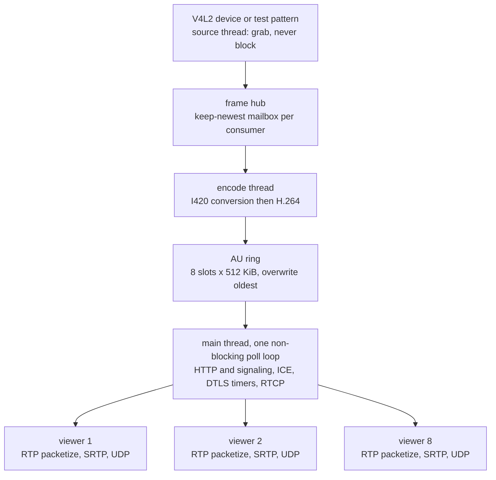
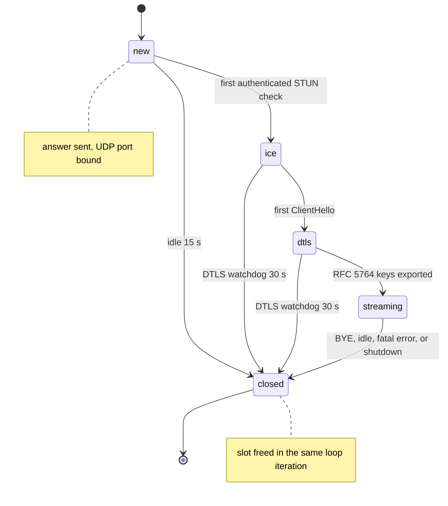
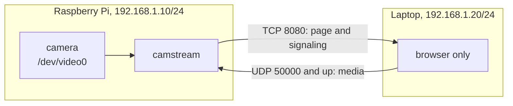

# camstream

`camstream` turns a Raspberry Pi (or any Linux box with a V4L2 camera) into a
low latency WebRTC camera server for a LAN. One C binary captures frames,
encodes H.264, and speaks real WebRTC to a browser tab: ICE-lite, DTLS 1.2,
SRTP, RTP/RTCP. No gateway, no signaling server, no relay, no JavaScript
build step, nothing to install on the viewer side beyond a browser.

The problem it solves: a browser cannot consume a raw V4L2 camera. Some piece
of software has to capture, encode, negotiate a peer connection, and keep the
connection alive when the viewer closes a tab or walks out of Wi-Fi range.
`camstream` is that piece. The project is about 18,000 lines of C across 50 files (plus libpeer), plus the vendored HTTP server.

## Contents

- [Architecture](#architecture)
- [Data flow](#data-flow)
- [WebRTC flow](#webrtc-flow)
- [Camera pipeline](#camera-pipeline)
- [Networking model](#networking-model)
- [Automatic LAN connection](#automatic-lan-connection)
- [Building](#building)
- [Running](#running)
- [Configuration](#configuration)
- [Camera setup](#camera-setup)
- [Firewall](#firewall)
- [LAN access: step-by-step check](#lan-access-step-by-step-check)
- [Web interface](#web-interface)
- [Diagnostics API](#diagnostics-api)
- [Recovery](#recovery)
- [Latency and performance](#latency-and-performance)
- [Security model](#security-model)
- [Project structure](#project-structure)
- [Testing](#testing)
- [WebRTC via libpeer (camstream-libpeer)](#webrtc-via-libpeer-camstream-libpeer)
- [Deployment](#deployment)
- [Troubleshooting](#troubleshooting)
- [Known limitations](#known-limitations)

## Architecture

Two binaries share the same camera pipeline. `build/camstream` uses the
in-house WebRTC stack; `build/camstream-libpeer` uses
[sepfy/libpeer](https://github.com/sepfy/libpeer) (pinned as a submodule).

In both, the media path runs in its own threads and never touches the network:

    camera (V4L2, CSI via rpicam-vid, stdin, or a synthetic pattern)
      -> frame pool (fixed count, refcounted, no allocation in the loop)
      -> frame hub (keep-newest mailbox per consumer)
      -> encoder thread (hardware V4L2 M2M or libx264)
      -> access-unit ring (8 slots x 512 KiB, overwrite oldest)

The control path runs on the main thread and owns everything asynchronous:
HTTP, WebRTC signaling, ICE, DTLS, SRTP, RTP, RTCP, and the timers for all of
them. The main thread never blocks; it polls the UDP sockets, runs Mongoose's
`mg_mgr_poll`, ticks every session, and pushes access units to viewers.



Why one loop instead of a thread per viewer: a LAN has one operator and up to
eight viewers, the per-packet work is a few microseconds, and a single thread
removes every lock between packetization, retransmission, and the RTCP state
that decides what to retransmit. The encoder is the only heavy consumer, and
it only runs while at least one viewer holds a session.

Removed along the way: a Janus RTP transport (requires an external
gateway, which this project explicitly does not need) and a vision/mosaic
experiment (no role in streaming, pulled in its own dependencies). See
`git log` for the removal commits; the interfaces they used are gone, not the
functionality. The libpeer stack now lives in its own binary
`camstream-libpeer` so the two implementations can be compared side by side.

## Data flow

1. The source thread fills a frame from the pool, timestamps it with
   `CLOCK_MONOTONIC`, publishes it to the hub, and waits for the next slot.
   The hub keeps only the newest frame per consumer, so a slow encoder drops
   frames instead of buffering them. This is where latency would otherwise
   accumulate.
2. The encoder thread converts YUYV/YU12 to I420 in a scratch buffer, encodes
   to Annex B H.264, and pushes the access unit with its presentation
   timestamp into the ring. The ring has 8 slots and overwrites the oldest,
   so the encoder can never block on the network.
3. The main thread drains the ring every iteration, splits each access unit
   into RTP packets (single NAL or FU-A, at most 1200 bytes of UDP payload),
   encrypts with SRTP, and sends one copy per viewer socket.
4. A per-viewer retransmission cache keeps the last 512 protected packets.
   An RTCP NACK from the browser is answered by re-sending the cached bytes,
   so a lost packet costs a repair instead of a stalled decoder.
5. Sender reports go out every second with the wall-clock NTP timestamp, so
   the browser can compute RTT and hold its jitter buffer small. A viewer
   that joins mid-GOP triggers an IDR request, so the encoder turns the next
   frame into a keyframe; requests are rate limited to one per 400 ms per
   session.

## WebRTC flow



1. The browser loads `/`, builds an offer with a receive-only video
   transceiver, and POSTs the SDP to `/api/webrtc/offer`.
2. The server parses the offer (ICE credentials, DTLS fingerprint, H.264
   payload type, mid, setup), allocates one UDP port for the session, and
   answers with `a=ice-lite`, `a=setup:passive`, a host candidate for every
   local IPv4 address, and the DTLS certificate fingerprint. The fingerprint
   is regenerated per process start and rotated by `POST /api/webrtc/restart`.
3. ICE: the server is ICE-lite. It never sends connectivity checks; it waits
   for the browser's STUN binding request, verifies MESSAGE-INTEGRITY with
   the negotiated credentials, answers with XOR-MAPPED-ADDRESS, and locks the
   session to that source address. A peer that moves (Wi-Fi roaming, DHCP
   change) is re-locked when an authenticated check arrives from the new
   address on the same port.
4. DTLS 1.2 handshake, server side passive. The certificate is a self-signed
   P-256 key generated in memory at startup and never written to disk. The
   server verifies the peer certificate against the fingerprint in the offer,
   and the browser verifies the server the same way with the answer; media
   flows only after the handshake completes and both sides are authenticated.
5. SRTP with `SRTP_AES128_CM_SHA1_80`, keys exported from the DTLS handshake
   (`EXTRACTOR-dtls_srtp`). The session moves to `streaming` only after the
   handshake completes and only when the peer actually negotiated a `use_srtp`
   profile; a peer that never offered the extension is refused rather than
   sent media encrypted with keys it does not have. The first keyframe is
   requested the moment the session reaches `streaming`.

Ports: one UDP port per session from `--udp-port`, up to 8 sessions. The
server binds each port when the session is created and closes it when the
session ends, so an idle server listens on TCP only.

## Camera pipeline

Capture sources, selected with `--source`:

| Source | How it works | Typical use |
| --- | --- | --- |
| `v4l2` | Opens the device, negotiates YUYV then YU12, uses 4 mmap buffers | USB camera, `/dev/video0` |
| `csi` | Spawns `rpicam-vid` (or `libcamera-vid`) and reads raw YUV420 from its pipe | Raspberry Pi CSI camera (IMX219, IMX477, IMX708, ...) |
| `stdin` | Reads raw YUV420 frames from standard input | Feeding test footage, `ffmpeg -i clip.mp4 -f rawvideo -pix_fmt yuv420p -` |
| `test` | Synthetic pattern at the requested size and rate | Bench testing, no hardware |

The CSI source is a pipe reader, not a libcamera client: the Pi camera stack
is a moving target and `rpicam-vid` is the interface that survives Pi OS
upgrades. The chain is

```
IMX219 -> libcamera ISP -> rpicam-vid --codec yuv420 --flush -o - -> pipe
       -> camstream -> H.264 -> RTP -> SRTP -> WebRTC -> browser
```

`rpicam-vid` pads every luma row to a multiple of 64 bytes (chroma to 32);
the source reports that stride and the encoder removes the padding, so any
even width works, but 640, 1280 and 1920 avoid the extra copy. The child is
started with `posix_spawn`, inherits no camstream socket (everything is
close-on-exec), gets a 1 MB pipe, and runs with `LIBCAMERA_LOG_LEVELS=*:WARN`
unless `--verbose` is given. EOF, a dead child, a truncated frame or 5 s
without data (15 s for the first frame) ends the source; the pipeline is then
rebuilt automatically (see [Recovery](#recovery)).

Why not `--source v4l2 --device /dev/video0` for a CSI camera: on current Pi
OS the sensor's `/dev/video0` is the raw Unicam/CFE capture node. It only
produces Bayer data, and only after libcamera has configured the media
graph, so opening it directly fails (`VIDIOC_STREAMON` errno 22, or a
3280x2464 pad format mismatch on the IMX219). That is expected; use
`--source csi`.

Encoders, selected with `--encoder`:

| Mode | Backend | Notes |
| --- | --- | --- |
| `auto` | Hardware first, then libx264 | Default. Also switches to libx264 if the hardware encoder fails while running |
| `hw` | V4L2 memory-to-memory, `/dev/video11` first, then any M2M H.264 encoder | Pi Zero 2/3/4 (bcm2835-codec). The Pi 5 has no H.264 encoder block |
| `hw:/dev/video11` | Same, explicit device | When the numbering is unusual |
| `sw` | libx264 | Needs `libx264-dev` at build time |

libx264 runs with preset `superfast`, tune `zerolatency` (no lookahead, no
B-frames, no frame delay), sliced threads (one per core, at most 4: slices
add no latency, unlike frame threads), constrained baseline, CBR-like VBV
(max rate = target, buffer = half a second), a fixed GOP of
`keyframe_seconds` with SPS/PPS repeated on every IDR. `/api/status` shows
`capture_fps`, `encode_fps` and `cpu_percent` to confirm the rate on the
device.

The hardware backend sets the capture (H.264) format with the real picture
size. The previous version left it at 0x0, which the bcm2835 encoder accepts
at `S_FMT` time and rejects when the port is enabled, surfacing as
`VIDIOC_STREAMON` errno 11 (EAGAIN); that is fixed, and a genuine
`EAGAIN`/`EBUSY` is retried three times before `auto` falls back to libx264.

The encoder runs only while a viewer is connected. With no viewer the source
keeps running (so `/api/status` still reports capture frames and errors) and
the encoder thread counts frames as `skipped_idle`. That is the difference
between a warm camera and a busy CPU on a Pi.

## Networking model

LAN only, deliberately. There is no STUN server, no TURN relay, no ICE
gathering beyond host candidates, and no cloud dependency of any kind. The
server and the browser must be able to reach each other directly.



| Port | Protocol | Direction | Purpose |
| --- | --- | --- | --- |
| 8080 | TCP | browser to server | Web page, `/api/*`, WebRTC signaling |
| 50000 to 50007 | UDP | browser to server | STUN, DTLS, SRTP (one port per session) |
| 5353 | UDP | both ways | mDNS name and service announcement (multicast 224.0.0.251) |

Outbound traffic from the browser uses an ephemeral UDP port that the
browser chose; the server learns it from the first valid STUN check and
answers to it. Nothing needs to be opened on the browser side beyond ordinary
client rules.

Browser requirements: a browser with `RTCPeerConnection`, DTLS 1.2, and
H.264 in WebRTC. Current Chrome, Chromium, Edge, Firefox and Safari all
qualify. The page is served over plain HTTP, which is fine because the page
only receives video; `getUserMedia` is not used, so the HTTPS requirement for
camera capture does not apply.

Finding the Pi: the server publishes `camstream.local` over mDNS, so the page
is at `http://camstream.local:8080/` with no address to look up, from a
router or over a single cable. The name appears in the startup log, in
`/api/status` under `mdns.url`, and in the footer of the page itself.
`/api/status` lists every non-loopback IPv4 address with its interface name
as the fallback, and the startup log prints those URLs as well; `hostname -I`
and `ip -4 addr` show them too.

## Automatic LAN connection

Three things make the server reachable without typing an address and
without touching the page after it loads: the name published over mDNS, the
page that connects itself, and the unit that starts the server at boot.

Start at boot (see [Deployment](#deployment) for the account and paths):

```sh
sudo make install
sudo systemctl daemon-reload
sudo systemctl enable --now camstream
systemctl status camstream
```

The page connects on load. It creates the peer connection, posts the offer
and starts the video as soon as the first keyframe arrives, which works
without a click because the video element is muted and there is no audio
track to play. The Connect button stays for a manual reconnect, and pressing
Disconnect stops the automatic path until Connect is pressed again. A failed
attempt is retried five times with a growing delay, then the state stops
changing and says so.

The name is announced on every non-loopback interface and re-announced when
an address appears or disappears, so plugging the cable in after boot needs
no restart. On a normal LAN the router hands out an address and the name
resolves through it. Between the Pi and one laptop with a single cable there
is no DHCP server, and both ends fall back to a link-local address in
169.254.0.0/16, which mDNS carries over the same cable.

Raspberry Pi OS (NetworkManager, Bookworm and later) does the link-local
fallback on its own, but waits for DHCP first and can withdraw the link-local
address when DHCP finally reports a failure. Pinning both makes it
immediate and stable:

```sh
nmcli con show                              # find the wired profile name
sudo nmcli con mod "Wired connection 1" ipv4.method auto \
     ipv4.link-local enabled ipv4.dhcp-timeout infinity
sudo nmcli con up "Wired connection 1"
ip -4 addr show dev eth0                    # expect a 169.254.x.x and DHCP address
```

`ipv4.link-local enabled` needs NetworkManager 1.40 or newer, and
`ipv4.link-local fallback`, which keeps the link-local address only when DHCP
fails, needs 1.52. On older images (dhcpcd) the fallback is built in and
needs no configuration. Windows and macOS clients configured for DHCP assign
themselves a 169.254.x.x address the same way, so nothing has to be set on
the laptop side.

Which clients resolve `.local`:

| Client | Resolution |
| --- | --- |
| macOS, iOS | Built in |
| Windows 10 1809 and later, Windows 11 | Built in |
| Linux with `systemd-resolved` | Enable with `resolvectl mdns eth0 yes` |
| Linux with avahi | Install `avahi-daemon` and `libnss-mdns` |
| Android 12 and later | Built in; older versions need the IP address |

If a client cannot resolve the name, the addresses printed at startup and
listed by `/api/status` work unchanged; the name is a convenience, not a
dependency.

Two cameras on one LAN must not share a name. The default is `camstream`,
and the responder probes before it claims the name, takes `camstream-2` and
up to `camstream-10` when it is taken, and logs a warning each time. Set
`mdns_name` explicitly when you run more than one:

```sh
camstream --config /etc/camstream.conf --mdns-name porch
```

## Building

Runtime and build dependencies:

| Dependency | Needed for | Debian/Ubuntu package |
| --- | --- | --- |
| OpenSSL 1.1.1 or 3.x | DTLS for `camstream` | `libssl-dev` |
| libsrtp2 | SRTP for `camstream` | `libsrtp2-dev` |
| libx264 (optional) | Software encoder (both binaries) | `libx264-dev` |
| cmake, python3-jsonschema, python3-jinja2 | Build libpeer (mbedtls) | `cmake`, `python3-jsonschema`, `python3-jinja2` |
| pthreads, libm | Threads and math | libc |
| Linux kernel headers | V4L2 ioctl definitions | `linux-libc-dev` |
| `rpicam-vid` (optional) | CSI camera | `rpicam-apps` |

`camstream-libpeer` does not need OpenSSL or libsrtp2: libpeer vendors
mbedtls and libsrtp2 inside its submodule, so `make camstream-libpeer` works
even when those system packages are missing.

On a Raspberry Pi OS or Debian machine:

```sh
sudo apt update
sudo apt install -y build-essential libssl-dev libsrtp2-dev libx264-dev
git clone https://github.com/ccsalman545/cam.git camstream
cd camstream
make -j4
```

That produces `build/camstream`, one executable with the web page embedded in
it. `make` locates OpenSSL, libsrtp2 and libx264 in `/usr/local`, then `/usr`;
`pkg-config` is not used, because Pi images often ship without it.

Building against dependencies installed somewhere else:

```sh
make DEPS_PREFIX=/opt/cam        # OpenSSL, libsrtp2, x264 under one prefix
make X264_DIR=/opt/x264          # only libx264 is elsewhere
make HAVE_X264=0                 # build without the software encoder
make OPT="-O3 -march=armv8-a"    # override optimisation
```

Without libx264 the binary still builds. `--encoder sw` then fails with
`libx264 support is not compiled in: install libx264-dev and rebuild`, and
`auto` tries the hardware encoder only.

A note on linking, so the claims here stay checkable: OpenSSL and libsrtp2
are linked as shared libraries when the system provides them, and as static
archives when only `.a` files are present. libx264 is frequently static
(`libx264.a`, no `.so`). Check what a given build actually needs with:

```sh
ldd build/camstream
```

Targets:

| Target | Effect |
| --- | --- |
| `make` | Build `build/camstream` |
| `make camstream-libpeer` | Build `build/camstream-libpeer` (needs the libpeer submodule and cmake) |
| `make test` | Build and run the native stack tests |
| `make test-libpeer` | Build and run the libpeer tests (SDP sanitizer + full ICE/DTLS/SRTP/H.264 flow) |
| `make install` | Install `camstream`, sample config and systemd unit |
| `make install-libpeer` | Install `camstream-libpeer` and its systemd unit |
| `make clean` | Remove `build/` |
| `make help` | List targets |

`camstream-libpeer` reuses the same capture and encoder code as `camstream`
(V4L2, `rpicam-vid` pipe with 64-byte stride handling, libx264 superfast
zerolatency and V4L2 M2M) and only replaces the WebRTC stack with libpeer.

`make install` honours `PREFIX` (default `/usr/local`), `SYSCONFDIR`
(default `/etc`), `UNITDIR` (default `/lib/systemd/system`) and `DESTDIR` for
packaging:

```sh
sudo make install
sudo make DESTDIR=/tmp/pkg PREFIX=/usr install
```

Build logging: every source is compiled with `-Wall -Wextra -Wpedantic
-Wshadow -Wundef -Wformat=2 -Wstrict-prototypes -Wpointer-arith -Wvla`. The
vendored Mongoose file is the only exception; it is compiled without the
warning set and with its own logging compiled out, so nothing writes to
stderr behind the logger.

## Running

```sh
# Test pattern, no camera: the quickest way to check the whole path
./build/camstream --test

# A USB camera
./build/camstream --source v4l2 --device /dev/video0 --width 1280 --height 720

# Raspberry Pi CSI camera (IMX219 etc.), hardware encoder when available
./build/camstream --source csi --width 1280 --height 720 --fps 30 --encoder auto --listen 0.0.0.0 --http-port 8080

# The same with libx264 (always available, required on a Pi 5)
./build/camstream --source csi --width 1280 --height 720 --fps 30 --encoder sw --listen 0.0.0.0 --http-port 8080

# From a config file, which also enables POST /api/config/reload
./build/camstream --config /etc/camstream.conf
```

The libpeer variant takes the same options (the UDP range is unused:
libpeer binds an ephemeral port per viewer):

```sh
./build/camstream-libpeer --source csi --width 1280 --height 720 --fps 30 --encoder auto --listen 0.0.0.0 --http-port 8080
./build/camstream-libpeer --test -W 640 -H 480 -F 30
```

It is built with:

```sh
git submodule update --init --recursive   # first time only, fetches libpeer and its deps
sudo apt install -y cmake python3-jsonschema python3-jinja2   # Pi OS: mbedtls code generation
make camstream-libpeer -j4
```

Cross compiling for a Pi 4 (aarch64) from an x86_64 host works with Zig as the
C toolchain (`pip install ziglang` gives `zig cc`):

```sh
make camstream-libpeer CMAKE=cmake LIBPEER_CMAKE_ARGS="-DCMAKE_TOOLCHAIN_FILE=cmake/zig-aarch64.cmake" CC="zig cc -target aarch64-linux-gnu"
```

Stop the service first if it is installed (`sudo systemctl stop camstream`
and `sudo systemctl stop camstream-libpeer`), otherwise the second instance
reports that TCP 8080 is already in use.

Then open `http://camstream.local:8080/` (or `http://<pi-address>:8080/`) in a
browser on the same LAN. Type the `http://` explicitly: the server speaks
plain HTTP only, and a browser that upgrades the address to `https://`
(Firefox HTTPS-Only mode, Chrome's "Always use secure connections", a
bookmarked https URL) gets `PR_END_OF_FILE_ERROR` / "secure connection
failed". The server answers such a TLS handshake with a TLS alert and logs
`TLS handshake on the plain HTTP port, the browser is using https://`.
WebRTC itself works from a plain-HTTP page on a LAN address because the page
only receives video (no camera or microphone permission is requested). The page connects itself; see
[Automatic LAN connection](#automatic-lan-connection). All options:

| Option | Default | Meaning |
| --- | --- | --- |
| `-s, --source KIND` | `v4l2` | `v4l2`, `csi`, `stdin`, `test` |
| `-d, --device PATH` | `/dev/video0` | V4L2 device |
| `-t, --test` | off | Shorthand for `--source test` |
| `--stdin-yuv420` | off | Shorthand for `--source stdin` |
| `--rpicam-bin PATH` | autodetect | Camera tool for `--source csi` |
| `-W, --width N` | 640 | Capture width |
| `-H, --height N` | 480 | Capture height |
| `-F, --fps N` | 30 | Capture rate |
| `-e, --encoder MODE` | `auto` | `auto`, `hw`, `hw:/dev/videoN`, `sw` |
| `-b, --bitrate KBPS` | 2500 | Target bitrate |
| `-K, --keyframe SEC` | 2 | IDR interval |
| `-l, --listen ADDR` | `0.0.0.0` | HTTP bind address |
| `-p, --http-port N` | 8080 | HTTP port |
| `-u, --udp-port N` | 50000 | First UDP media port |
| `-n, --mdns-name NAME` | `camstream` | Published as `NAME.local`; empty value turns the responder off |
| `--mdns on\|off` | on | Answer mDNS queries |
| `--mdns-port N` | 5353 | Responder UDP port |
| `--config PATH` | none | Config file |
| `-v, --verbose` | off | DEBUG to stderr as well as `/api/logs` |
| `-h, --help` | | Usage |
| `-V, --version` | | Version |

The server exits with status 0 on SIGINT and SIGTERM after closing sessions,
stopping the capture thread, and freeing the DTLS context.

## Configuration

Every option has a config file equivalent. The file is read first, command
line options override it, and an unknown key or an out-of-range value makes
the server refuse to start rather than silently ignoring a typo:

```ini
source = v4l2
device = /dev/video0
width = 640
height = 480
fps = 30
encoder = auto
bitrate_kbps = 2500
keyframe_seconds = 2
listen = 0.0.0.0
http_port = 8080
udp_port = 50000
mdns = on
mdns_name = camstream
mdns_port = 5353
verbose = 0
```

`config/camstream.conf` is that file with comments and is installed to
`/etc/camstream.conf`. `make install` copies it; edit the installed copy.

`POST /api/config/reload` re-reads the file and applies what can change
without interrupting the stream:

- applied live: `bitrate_kbps` (queued to the encode thread, which owns
  the encoder handle and applies it before its next frame)
- reported under `restart_required`: everything else that changed
  (`source`, `device`, `width`, `height`, `fps`, `encoder`, ports, `listen`,
  `mdns`, `mdns_name`, `mdns_port`)

`mdns_name` is the single label published as `<name>.local`; letters, digits
and `-` only. `mdns_port` is the responder's UDP port and only needs changing
when something else on the same host must not see these packets, for example
a test run. Turning the responder off (`mdns = off`, or `--mdns-name ""` for
one run) removes the name but leaves the HTTP interface untouched.

The response lists exactly which keys were applied and which need a restart.
A viewer is never dropped by a reload. If the file has an error, the reload
is refused with the reason and the running configuration is untouched.

## Camera setup

USB camera:

```sh
ls /dev/video*                    # device nodes the kernel created
v4l2-ctl --list-devices           # which node belongs to which camera
v4l2-ctl -d /dev/video0 --list-formats-ext
./build/camstream --source v4l2 --device /dev/video0
```

If the user running `camstream` is not root, it needs access to the device:
`sudo usermod -aG video $USER`, then log out and back in.

Raspberry Pi camera:

```sh
sudo apt install -y rpicam-apps
rpicam-hello --list-cameras     # confirms the sensor is detected (imx219 ...)
rpicam-vid -t 2000 -n --width 1280 --height 720 --codec yuv420 -o /dev/null
./build/camstream --source csi --width 1280 --height 720 --fps 30
```

Do not point `--source v4l2` at the CSI sensor's `/dev/video0`; see
[Camera pipeline](#camera-pipeline).

The CSI sensor is single-owner: `camstream` logs a warning naming the process
holding it if another program (a `libcamera` preview, another server) has the
camera open. Stop that process first. `camstream` spawns `rpicam-vid` and
reads raw YUV420 from its stdout, so the child's own errors appear in the
same log stream.

Isolated test pattern, no camera at all:

```sh
./build/camstream --test --encoder sw
```

## Firewall

The default install needs TCP 8080 and UDP 50000 to 50007 from the LAN. With
`ufw`:

```sh
sudo ufw allow from 192.168.1.0/24 to any port 8080 proto tcp
sudo ufw allow from 192.168.1.0/24 to any port 50000:50007 proto udp
```

With `firewalld` (Fedora-style images, some Pi setups):

```sh
sudo firewall-cmd --list-all
sudo firewall-cmd --permanent --add-port=8080/tcp --add-port=50000-50007/udp
sudo firewall-cmd --reload
```

With `iptables` or `nftables` the same two rules, restricted to the LAN
interface, are enough. Do not port-forward these to the internet: the
management endpoints have no authentication, by design, because the threat
model is a trusted LAN (see [Security model](#security-model)).

If the browser connects to the page but the video stays black, a blocked UDP
range is the first thing to check. `POST /api/webrtc/restart` frees the UDP
ports if another process is holding one.

## LAN access: step-by-step check

Go down this list in order and stop at the first step that fails; each one
depends on the ones above it. Run steps 1 to 6 on the Pi.

```sh
# 1. build and start (service stopped, so the port is free)
make clean && make
sudo systemctl stop camstream
./build/camstream --source csi --width 1280 --height 720 --fps 30 --encoder auto --listen 0.0.0.0 --http-port 8080
#    the log must show:  http: listening on 0.0.0.0:8080
#                        media: pipeline running: capture csi (rpicam-vid) 1280x720 @ 30 fps -> ...

# 2. port 8080 is listening on all interfaces, UDP media ports are free
sudo ss -ltnp 'sport = :8080'          # LISTEN 0.0.0.0:8080 users:(("camstream",...))
sudo ss -lunp | grep -E ':500[0-9]{2}' # one line per connected viewer

# 3. addresses and link state
ip -4 addr show
nmcli device status

# 4. HTTP from the Pi itself, loopback and LAN address (use your eth0 address)
curl -sS -o /dev/null -w '%{http_code}\n' http://127.0.0.1:8080/
curl -sS -o /dev/null -w '%{http_code}\n' http://192.168.0.28:8080/
curl -sS http://127.0.0.1:8080/api/status | python3 -m json.tool | head -60

# 5. firewall
sudo firewall-cmd --list-all 2>/dev/null || sudo ufw status verbose 2>/dev/null || sudo nft list ruleset | head -50

# 6. from another PC on the LAN
curl -sS -o /dev/null -w '%{http_code}\n' http://192.168.0.28:8080/
```

Then in a browser on the other PC open `http://192.168.0.28:8080/` (typed
with `http://`). The "Pipeline layers" panel on the page, and `layers` in
`/api/status`, show where the stream stops:

| Layer | Meaning when not flowing | Where to look |
| --- | --- | --- |
| `capture` | no frames from the camera | log `capture:` lines, `rpicam-hello --list-cameras` |
| `encoder` | `idle` without a viewer is normal; `stalled`/`failed` is not | log `encode:` lines, `encoder.kind` |
| `http` | the page itself would not load | steps 2 to 6 above |
| `ice` | no authenticated STUN check: UDP 50000-50007 blocked, or the browser tried an unreachable candidate | firewall, `stun_rejected` in `/api/stats` |
| `dtls` | handshake did not complete | log `dtls:` lines, `handshake_failures` |
| `rtp` | connected but no media sent in the last 2 s (encoder, or waiting for a keyframe) | `frames_sent`, `frames_held`, `waiting_keyframe` in `/api/stats` |
| `rtcp` | media sent but no receiver report from the browser | packets are lost on the way; `peer` address in `/api/stats` |
| `browser_decode` | the page reports no growing `framesDecoded` | `chrome://webrtc-internals`, `about:webrtc` |

`state` in `/api/status` is only `streaming` when access units went out in
the last 2 s and the browser acknowledged them with RTCP receiver reports;
`sending` means media leaves but nothing is acknowledged, `no-media` means
connected but nothing to send.

`peer` in `/api/stats` is the source address of the browser's authenticated
STUN checks, i.e. the real remote viewer; `signaling_peer` is the address
that posted the offer. A peer equal to one of the Pi's own addresses means
the viewer ran on the Pi itself (for example a desktop browser on
`http://127.0.0.1:8080/`), and the log says so.

## Web interface

`web/index.html` is plain HTML, CSS and a few hundred lines of JavaScript. It
is embedded into the binary at build time, so there is no web root to deploy
and no way for the page to drift from the binary that serves it.

The page shows the video, the connection state (it says `streaming` only
once the video element plays decoded frames), a "Pipeline layers" panel,
camera and encoder state
(codec, resolution, capture and encode FPS, bitrate), transport counters
(packets, bytes, retransmissions, NACKs, PLIs, send errors, RTT, loss),
CPU and memory, and the server log with a level filter. Buttons cover
Connect/Disconnect, camera restart, WebRTC restart and config reload. The
footer repeats the addresses, the UDP media range, the HTTP port and the
published `mdns.url`.

Opening the page is enough to see video: it connects on load and retries five
times with a growing delay when the server or the camera is not ready yet.
Disconnect stops the automatic retries, Connect starts them again. See
[Automatic LAN connection](#automatic-lan-connection).

It uses `RTCPeerConnection` with `iceServers: []` (no STUN, no TURN),
`fetch()` for the API, and no third-party library, framework, bundler or
build step. The same job can be done by hand from a browser console with
`fetch` plus `RTCPeerConnection` if a page is not available.

## Diagnostics API

| Method | Path | Purpose |
| --- | --- | --- |
| GET | `/` | Web interface |
| GET | `/api/status` | Subsystem state, counters, interfaces, rates |
| GET | `/api/stats` | Transport counters, per-session detail |
| GET | `/api/logs` | Recent log ring, `?limit=1..256&level=debug|warn|info|error` |
| POST | `/api/webrtc/offer` | WebRTC signaling, body `{"sdp":"..."}` |
| POST | `/api/webrtc/close` | Close one session, body `{"session_id":N}` |
| POST | `/api/webrtc/client-stats` | The page reports `frames_decoded` (diagnostic only) |
| POST | `/api/camera/restart` | Rebuild the capture and encode pipeline |
| POST | `/api/webrtc/restart` | Drop all sessions, new DTLS certificate |
| POST | `/api/config/reload` | Re-read the config file |

Unknown paths return `404` with a JSON error, unsupported methods `405`,
malformed signaling input `400` with the parser's reason. Every error reply
is JSON with an `error` field.

`/api/status` reports: overall `state` (`idle`, `connecting`, `no-media`,
`sending`, `streaming`, `camera-error`), `http` (bound address, open
connections, TLS attempts rejected), `source` (kind, name, geometry,
capture FPS, frames, errors), `encoder` (name, kind, preference, bitrate,
frames, keyframes, status `idle|ok|stalled|failed`), `pipeline` (running,
last error, next automatic retry), `layers` (see
[LAN access](#lan-access-step-by-step-check)), `webrtc` (DTLS state
and fingerprint, session counts, handshake counters), `media` (capture and
encode FPS, bitrate, dropped access units, idle and mismatched frames skip
counters), `process` (CPU percent, RSS in KiB, log counters), the `interfaces`
the browser can use, the `config_file` in use, and `last_error` when the log
holds an error message.

`/api/stats` adds RTP totals (packets, bytes, bitrate, retransmissions,
NACKs, PLIs, RTCP sent, send errors) and one object per session with state,
ICE peer and signaling peer addresses, negotiated H.264 payload type and
profile-level-id, frames and keyframes sent, frames held while waiting for a
keyframe, age of the last media and of the last receiver report, frames the
browser reports as decoded, RTT, loss, jitter, per-session counters for datagrams received,
STUN checks accepted and rejected, retransmissions, and socket errors.

Examples:

```sh
curl -s http://192.168.1.10:8080/api/status | python3 -m json.tool
curl -s 'http://192.168.1.10:8080/api/logs?limit=20&level=warn'
curl -s -X POST http://192.168.1.10:8080/api/camera/restart
curl -s -X POST http://192.168.1.10:8080/api/webrtc/restart
curl -s -X POST http://192.168.1.10:8080/api/config/reload
curl -s -H 'Content-Type: application/json' \
     -d '{"sdp":"<offer>"}' http://192.168.1.10:8080/api/webrtc/offer
```

There is no endpoint that executes a command, opens a file by name, or
restarts the process. The four POST endpoints above are the whole set of
state-changing operations.

## Recovery

| Symptom | Action |
| --- | --- |
| Video frozen, page still live | The browser socket is still open; press Connect again, or wait for the DTLS watchdog (30 s) and the page's automatic single retry |
| Camera unplugged or `rpicam-vid` died | Automatic: the pipeline is rebuilt after 5 s, then 10, 20, ... up to 60 s between attempts. `POST /api/camera/restart` retries at once |
| Hardware encoder fails while running | Automatic: rebuilt at once; with `encoder = auto` it continues on libx264 |
| Handshake failures after a browser cache reset | `POST /api/webrtc/restart` rotates the certificate and drops stale sessions |
| Bitrate or verbose flag changed on disk | `POST /api/config/reload` |
| Server feels wedged | `GET /api/logs?level=error` then `GET /api/status`; a hang would be visible as a stale `uptime_sec` and `requests` counter |

The HTTP interface stays up when the camera or WebRTC fails. A missing camera
or a failed DTLS initialisation is reported through `/api/status` and
`/api/logs`, and the process keeps serving, because a management interface
that dies together with the thing it manages is useless.

Sessions clean up after themselves: closing a tab sends RTCP BYE, the server
destroys the session and closes the UDP socket; a tab that vanishes without
BYE is reaped after 15 s of inactivity. `POST /api/webrtc/restart` closes all
sessions immediately.

## Latency and performance

What "low latency" means here: capture to display in the browser, not zero.
The pipeline is built to avoid queuing, which is what usually turns a
streaming setup into a seconds-behind one: the frame hub keeps only the
newest frame per consumer, the access-unit ring overwrites the oldest slot,
the RTP packetizer uses 1200-byte packets, and sender reports go out every
second so the browser keeps a shallow jitter buffer. The browser controls
its own playout delay; nothing on the server buffers decoded or encoded
video.

Measure it, do not assume it:

1. Network contribution: `GET /api/stats`, read `rtt_ms` for the session.
   That is the RTCP round trip, and it is a lower bound for the one-way delay
   contributed by the network.
2. End-to-end: put a millisecond clock (a phone stopwatch app, or a page
   showing `Date.now()`) in front of the camera, fill the browser viewport
   with the stream, and capture both in one photo or screenshot. The
   difference between the clock in the stream and the clock on the screen is
   the glass-to-glass latency including capture, encode, network, decode and
   display. Repeat ten times and take the median; a single sample is noise.
3. Browser side: `chrome://webrtc-internals` shows `framesPerSecond` and the
   inbound statistics for the peer connection, and
   `video.requestVideoFrameCallback` in the console timestamps displayed
   frames.

RTT (`rtt_ms`) is computed per RFC 3550 section 6.4.1 from the receiver
report block about our SSRC: `RTT = A - LSR - DLSR` in 1/65536 s units,
converted to milliseconds. The previous version read LSR/DLSR at the wrong
offsets of the report block, which produced values like 59770778 ms; it now
reports -1 until a valid report arrives rather than a made-up number.

Server cost has to be measured on the device: `/api/status` gives
`capture_fps`, `encode_fps` and `process.cpu_percent`, and `top -H -p $(pidof
camstream)` shows the capture, encode and main threads separately. The
earlier libx264 setup (`veryfast`, one thread) reached only about 13 encode
FPS at 1280x720 on a Pi; `superfast` with sliced threads is the fix, with
the latency properties of `zerolatency` unchanged.

Knobs that matter, in order: use the hardware encoder (`--encoder hw`);
lower `--fps`; lower `--width`/`--height`; raise `--keyframe` to save
bitrate; raise `--bitrate` only if the picture is visibly soft, since a
higher bitrate on a weak Wi-Fi link costs more than it buys.

## Security model

`camstream` assumes a trusted LAN. It has no authentication, no TLS on the
HTTP interface, and no user accounts, because adding them would not protect
anything on a network where an attacker can already see the video by
connecting. Concretely:

- Anyone who can reach TCP 8080 can read the page, the status, the stats and
  the logs, create sessions (up to 8), and invoke the four POST endpoints.
- Anyone who can reach the UDP range can send datagrams; they are ignored
  unless they pass STUN MESSAGE-INTEGRITY or the DTLS handshake for an
  existing session.
- Media is encrypted with SRTP. DTLS certificates are self-signed and
  regenerated at every start; there is no CA and no pinning beyond the SDP
  fingerprint exchange. A peer whose certificate does not match the
  fingerprint in its offer, or whose handshake negotiated no `use_srtp`
  profile, never receives media.
- There is no shell, no file API, no `system()` call, and no dynamic code
  loading. All external input (HTTP requests, SDP, STUN, RTP, RTCP, mDNS
  packets) is parsed with explicit length checks and bounded buffers. The
  mDNS parser walks at most eight questions and sixty-four records per
  packet, refuses name compression loops, and never follows a pointer
  outside the packet.
- mDNS is unauthenticated by design: any host on the LAN can claim the
  published name, and nothing here detects or repairs that beyond renaming
  this responder. It publishes the same addresses `/api/status` already
  lists, so it reveals nothing that a scan of the LAN would not.

If the server must be reachable from an untrusted network, put it behind a
VPN or an SSH tunnel, or front it with a reverse proxy that terminates TLS
and authenticates, and firewall the UDP range to the addresses that need it.
Treat any port-forward to the internet as unsafe: the failure mode is not
just stolen video, it is strangers driving the restart endpoints.

## Project structure

```
Makefile                  two binaries (native + libpeer), tests, install
config/camstream.conf     commented sample configuration
packaging/camstream.service          systemd unit for camstream
packaging/camstream-libpeer.service  systemd unit for camstream-libpeer
web/index.html            native stack web interface, embedded at build time
web/libpeer.html          libpeer stack web interface, embedded at build time
third_party/libpeer/      pure C WebRTC (sepfy/libpeer, pinned, with mbedtls/libsrtp/usrsctp/cJSON)
tools/embed_assets.c      build-time page embedder
third_party/mongoose/     HTTP server (vendored, MIT)
src/
  camstream_main.c        process entry point, signals, log level
  app/
    app_config.c          defaults, config file, argv, usage, summary
    app_server.c          main poll loop, HTTP routes and JSON replies
    log.c                 ring buffer, levels, console and /api/logs
    sysinfo.c             /proc based CPU and memory sampling
  media/
    v4l2_source.c         V4L2 mmap capture
    csi_source.c          rpicam-vid pipe capture, stdin capture
    test_source.c         synthetic pattern
    frame_pool.c          refcounted frame pool
    frame_hub.c           keep-newest mailbox per consumer
    yuv_convert.c         YUYV/YU12 to I420
    au_ring.c             access-unit ring, overwrite oldest
    encoder_worker.c      encode thread, IDR requests, stats
    encoder_x264.c        libx264 backend
    encoder_v4l2m2m.c     hardware V4L2 M2M backend
    h264_encoder.c        backend selection by preference
    source_worker.c       capture thread with fatal error accounting
  net/
    mdns.c                mDNS responder: name, service discovery, conflicts
  webrtc/
    ice_lite.c            STUN parsing, ICE-lite checks, FINGERPRINT
    dtls_srtp.c           DTLS 1.2, certificate, SRTP key export
    rtp_h264.c            single NAL and FU-A packetization
    rtcp.c                sender reports, RR/NACK/PLI/FIR parsing
    sdp.c                 offer parsing, answer generation
    webrtc_session.c      per-viewer session: state, timers, retransmit
  lpstream/
    camstream_libpeer_main.c  entry point for the libpeer binary
    lp_server.c           HTTP signaling, pipeline ownership, media fan-out thread
    lp_session.c          one viewer: libpeer PeerConnection + thread, IDR-gated start
    lp_sdp.c              browser answer sanitizer protecting libpeer's fixed buffers
include/                  one header per module, no implementation leaks
tests/                    see below (including libpeer tests)
```

## Testing

```sh
make test
```

Seven test binaries. Six link the real modules directly; `test_lan_stream`
links OpenSSL and libsrtp2 only, because it acts as the browser and drives the
built `camstream` binary over HTTP, UDP and multicast DNS:

| Test | Covers |
| --- | --- |
| `test_stun` | STUN message parsing, MESSAGE-INTEGRITY verification, XOR-MAPPED-ADDRESS, fingerprints, RFC 5769 vectors, malformed input |
| `test_encoder_worker` | Encode loop with a stub encoder: frame accounting, mismatch and bad-size drops, stall watchdog, IDR handling, queued bitrate change applied by the encode thread |
| `test_csi_source` | stdin frame reads, short frames, missing binary, mock camera process |
| `test_mdns` | The responder against packets built by hand: probe and announcement timing, A record address, TTL and cache-flush flags, service discovery PTR, SRV port and TXT strings, legacy unicast replies with an echoed transaction ID and a clamped TTL, known answer suppression, seven malformed packets, name conflict rename with its rate limit, giving up when every suffix is taken, and the goodbye packet |
| `test_rtc_session` | The real session against a browser-role client: STUN check with valid and invalid integrity, DTLS handshake, SRTP key export and decrypt, NAL reassembly, RTP timestamp advance at 90 kHz, SRTCP NACK and retransmission, malformed datagrams, idle timeout, and a peer that never offers `use_srtp` being refused with the failure counted |
| `test_server_api` | The real binary over HTTP: every endpoint, 404 and 405 handling, malformed offers, oversized bodies, garbage requests and a 4 KiB URI, eight concurrent sessions plus slot recycling and the ninth viewer being refused, certificate rotation, config reload (applied, unchanged and refused), camera failure with the HTTP interface still serving, and a start from the configuration file `make install` ships, which catches a bad value in that file. Ends with a clean SIGTERM shutdown |
| `test_lan_stream` | The real binary driven the way a browser drives it: the server is started with a test config, its mDNS name resolved through a real query, ICE check answered with a verified MESSAGE-INTEGRITY, DTLS 1.2 handshake with the certificate matching the answer's fingerprint, SRTP key export and decrypt, access units reassembled from single NAL and FU-A packets, a keyframe for a viewer that joins late, SRTCP Sender Reports, viewer close, a second viewer streaming without a restart, and SIGTERM exiting with status 0 |

Test quality rules followed here: a test only passes if the module under test
produced the observed output, no test asserts on a reimplementation of the
logic it is checking, and anything that cannot run in the test environment
(hardware camera, hardware encoder, real browser) is covered by the black-box
test through the API instead of being faked.

Not covered: a real camera, a real hardware encoder, real browsers, and
long-run stability beyond the process lifetime of a test.

Not covered automatically either: the address that appears *after* the server
started, which is the case the mDNS responder exists for. It needs an
interface to change, so it is checked by hand in a network namespace, where
anything can be plugged in without touching the machine:

```sh
unshare -rn sh -c '
  ip link set lo up
  /path/to/camstream --test --http-port 18996 --mdns-name camstream \
      --mdns-port 15353 --udp-port 60996 2>&1 | grep -E "mdns|mDNS" &
  sleep 2
  ip link add veth0 type veth peer name veth1     # the cable goes in
  ip link set veth0 up
  ip addr add 192.0.2.55/24 dev veth0
  sleep 3
  kill %1'
```

Expected: a warning that there is no address yet, then
`camstream.local is now announced on 1 address(es), first 192.0.2.55`, and any
mDNS resolver inside that namespace resolving the name to that address. Running
the query outside the namespace needs the address instead, because the
namespace has its own loopback.

Memory errors and thread races are checked with the same suite rather than by
inspection. Both commands were run against this tree and passed with no
report:

```sh
# Leaks, use after free, out of bounds, undefined behaviour
make clean
make -j4 OPT="-O1 -g -fsanitize=address,undefined -fno-omit-frame-pointer"
ASAN_OPTIONS=detect_leaks=1 make test

# Races between the capture, encode and HTTP threads
make clean
make -j4 OPT="-O1 -g -fsanitize=thread"
./build/camstream --test --encoder sw --http-port 8080
```

The sanitizer flags reach the link line as well as the compile lines, which
is why `OPT` is repeated there.

## Deployment

`make install` (as root) copies three files: the binary to
`/usr/local/bin/camstream`, the commented sample config to
`/etc/camstream.conf` (an existing file is kept; the new defaults are then
written to `/etc/camstream.conf.new`), and the unit to
`/lib/systemd/system/camstream.service`. It prints the SHA-256 of the built
and the installed binary, which must be equal.

```sh
make clean && make
sudo make install
sudo systemctl daemon-reload
sudo systemctl enable camstream
sudo systemctl restart camstream
systemctl status camstream --no-pager
journalctl -u camstream -n 50 --no-pager
# the running process uses the file that was just installed:
sha256sum build/camstream /usr/local/bin/camstream
sudo ls -l /proc/$(pidof camstream)/exe
```

The shipped config uses `source = csi` at 1280x720@30. An older
`/etc/camstream.conf` may still say `source = v4l2`; compare it with
`/etc/camstream.conf.new`.

The installed unit starts `camstream` with `/etc/camstream.conf`, restarts it
on failure, and lets it join the `video` group. It ships without `User=` so
it works on a fresh install; a dedicated account is better and is one edit
away:

```sh
sudo useradd --system --no-create-home --groups video camstream
sudo sed -i 's/^#User=camstream$/User=camstream/;s/^#Group=camstream$/Group=camstream/' \
        /lib/systemd/system/camstream.service
sudo systemctl daemon-reload
```

Then edit `/etc/camstream.conf` for your camera and geometry, and confirm the
unit's `ExecStart` path matches where `make install` put the binary when you
override `PREFIX`. The installed configuration already has the mDNS responder
on, so the page answers at `http://camstream.local:8080/` right after the
first boot with no further setup; see
[Automatic LAN connection](#automatic-lan-connection).

To update, rebuild and `sudo make install`, then `sudo systemctl restart
camstream`. For the libpeer variant:

```sh
make camstream-libpeer
sudo make install-libpeer
sudo systemctl daemon-reload
sudo systemctl restart camstream-libpeer
```

`install-libpeer` installs `camstream-libpeer` and
`camstream-libpeer.service`; it reuses `/etc/camstream.conf` when present.

## Troubleshooting

| Symptom | Check |
| --- | --- |
| `v4l2: cannot open /dev/video0` | Device path, permissions, `video` group membership |
| `VIDIOC_STREAMON failed: errno=16 (Device or resource busy)` | Another process holds the camera; `fuser -v /dev/video0` |
| `csi: camera busy: PID ... holds it` | Log names the PID; stop it |
| Browser: `PR_END_OF_FILE_ERROR`, "secure connection failed", "connection was reset" | The browser used `https://`. Type `http://<pi>:8080/`; the log shows `TLS handshake on the plain HTTP port` |
| `http: cannot listen on 0.0.0.0:8080: TCP port 8080 is already in use` | The service (or another instance) runs: `sudo ss -ltnp 'sport = :8080'`, `sudo systemctl stop camstream` |
| `curl http://127.0.0.1:8080/` works, the LAN address does not | `listen` is not `0.0.0.0`, or a firewall: [LAN access](#lan-access-step-by-step-check) |
| `VIDIOC_STREAMON` errno 22 on `/dev/video0` with a CSI camera | Expected: use `--source csi` |
| `m2m ... VIDIOC_STREAMON ... errno=11` | Hardware encoder refused the stream; `auto` falls back to libx264, `--encoder sw` skips the probe |
| `peer` in stats is the Pi's own address | The viewer runs on the Pi; open the page from the other PC |
| Page loads, Connect stays on `connecting` | Firewall blocks UDP in the media range; check the browser console and `/api/logs` |
| `ICE failed` in the page and `stun_rejected` climbing in stats | The offer was regenerated by a stale page; press Connect again, then `POST /api/webrtc/restart` |
| Black video, counters climbing | Encoder issue: `/api/status` `encoder.status`, `media.skipped_mismatch`, `/api/logs` |
| Frozen after Wi-Fi drop | The 30 s DTLS watchdog closes the session; the page retries five times automatically, otherwise press Connect |
| `camstream.local` does not resolve | Client without mDNS (table in [Automatic LAN connection](#automatic-lan-connection)); use the addresses from `/api/status`. On Linux check `resolvectl query camstream.local` |
| The name resolves to the wrong address, or `mdns: name conflict` in the log | Another host claims the name; the log names the suffix it moved to, or set `mdns_name` |
| `mdns: responder unavailable: bind to 0.0.0.0:5353 failed` | Another responder owns the port and refuses to share it; the server keeps serving by address |
| `OpenSSL headers not found` from `make` | Install `libssl-dev` or pass `DEPS_PREFIX` |
| `libsrtp2 headers not found` from `make` | Install `libsrtp2-dev`; a source build needs `--enable-openssl` |
| High CPU with no viewer | Expected only in `stdin`/`test` capture; a real camera using the hardware encoder idles near zero |

Errors name the subsystem and the operation, and include `errno` when a
system call failed, for example:

```
[    1.234] ERROR capture: v4l2 VIDIOC_STREAMON: errno=16 (Device or resource busy)
```

Log levels: `error` for failures needing attention, `warn` for recoverable
degradation, `info` for state changes and configuration (the default console
level), `debug` only with `--verbose`. Log output is one line per event on
stderr; the same entries, with timestamps, are available from `/api/logs`
without `--verbose`, because the ring keeps all levels.

## Known limitations

- Plain HTTP only. There is no HTTPS listener; a browser forced to
  `https://` cannot load the page (the server rejects the TLS handshake with
  an alert and logs it).
- The Pi 5 has no hardware H.264 encoder; `auto` uses libx264 there.
- The V4L2 M2M fixes (capture format size, stream-on order, one-by-one
  controls) follow the bcm2835-codec driver source and pass the build and
  the test suite, but they have not been run on Pi hardware in this
  revision.
- LAN only. No STUN, TURN, or internet traversal; ICE-lite with host
  candidates assumes the browser can reach the server's addresses.
- Video only. No audio, no `getUserMedia` on the page.
- H.264 only, constrained baseline (`42e01f`), because that is what both
  encoder backends produce and what every browser decodes.
- Eight concurrent viewers for the native stack, four for libpeer (one thread
  per viewer), each viewer gets the same encoded stream. There is no
  per-viewer scaling or simulcast.
- libpeer build quirk: upstream `src/config.h` defines `CONFIG_MTU` without
  `#ifndef`, so `-DCONFIG_MTU` cannot override it. The test binary works
  around it with a forced include (`tests/libpeer_rx_config.h`) that undefines
  and redefines the value to 1500, giving room for the 10-byte SRTP tag on
  full-size packets. Browsers are unaffected; only a libpeer receiver needs it.
- Changing resolution, FPS, source, device, encoder, or ports requires a
  restart; `/api/config/reload` only re-applies the bitrate.
- No recording, no snapshot endpoint, no RTSP or HLS.
- No authentication on the HTTP interface by design; see
  [Security model](#security-model). The mDNS name is unauthenticated too:
  any host on the LAN can claim it, and a hostile host can therefore take
  `camstream.local` or answer with its own address. The name is a convenience
  for a trusted LAN, the addresses in `/api/status` are the ground truth.
- mDNS publishes IPv4 addresses only, so an IPv6-only network needs the
  address instead of the name.
- The retransmission cache covers 512 packets and the access-unit ring 8
  slots; a viewer that stops reading faster than the encoder produces will
  lose quality rather than apply backpressure, which keeps latency bounded
  at the cost of artifacts.
