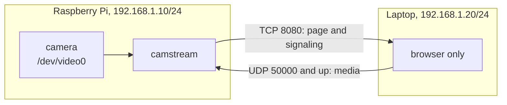
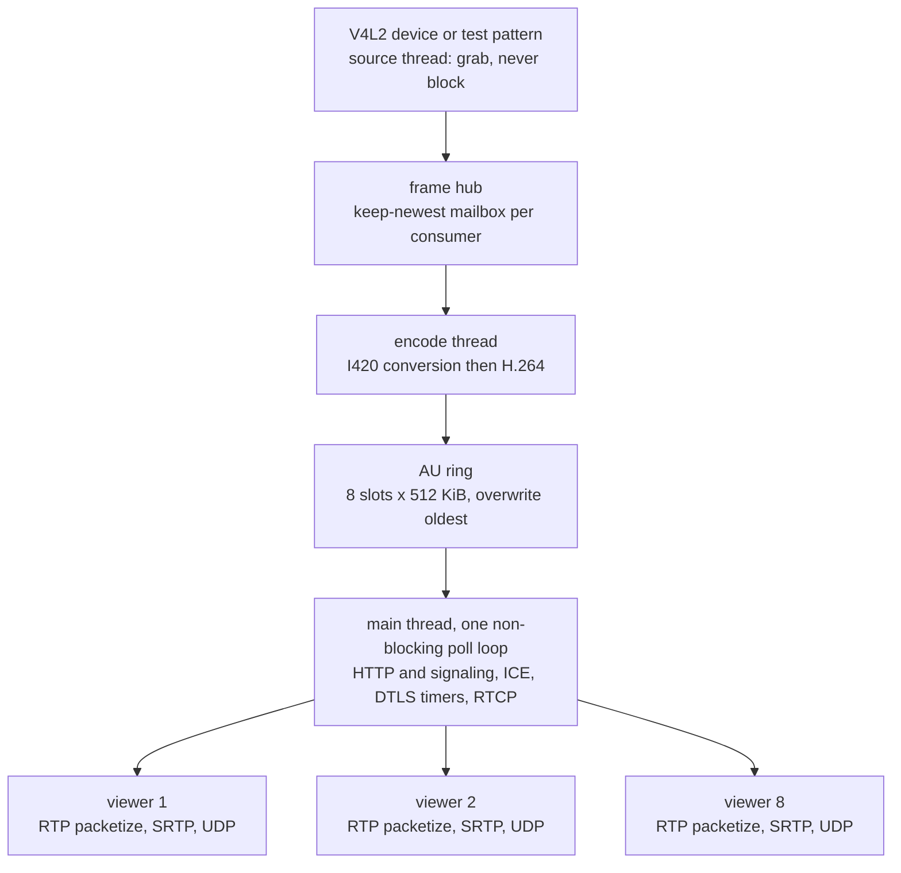
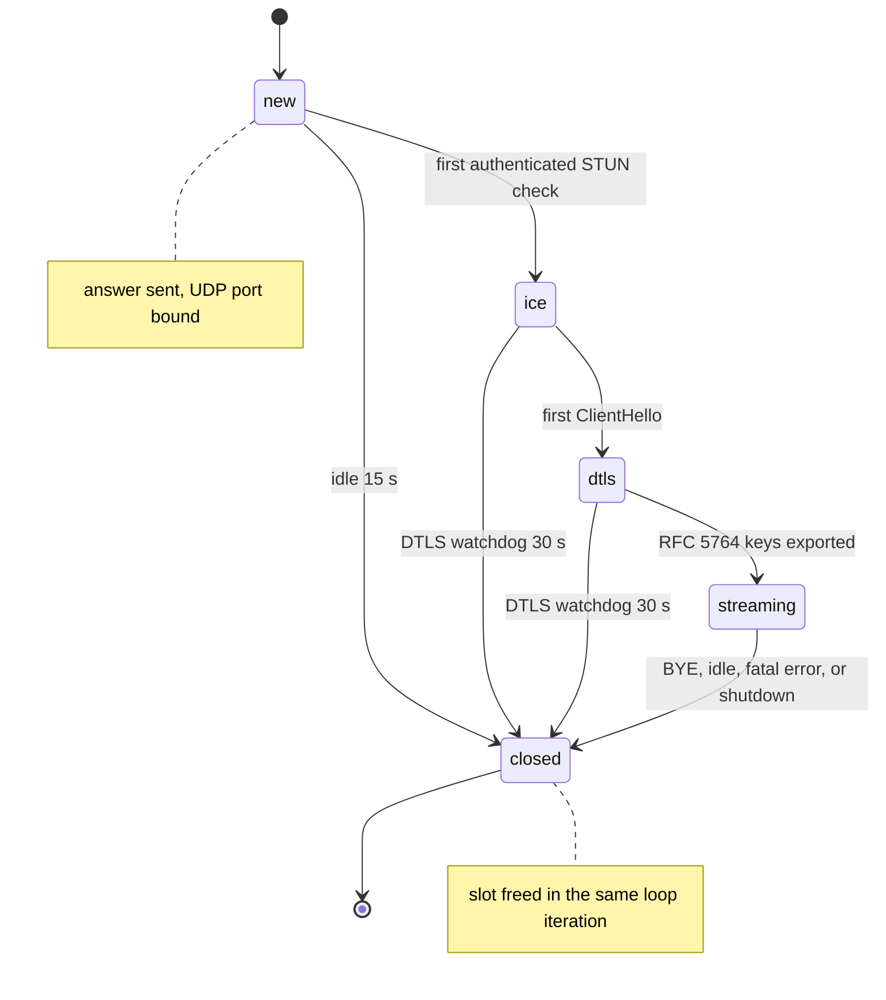
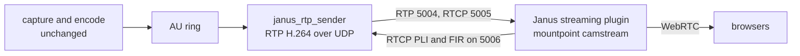

<div align="center">

# camstream

**A webcam-to-browser WebRTC server written in C11.**

Real WebRTC media from a Raspberry Pi or any Linux machine to a browser tab:
ICE-lite, DTLS 1.2, SRTP, and RTP/H.264 implemented directly in C against
OpenSSL and libsrtp2. No cloud, no signaling server, no STUN or TURN, no
containers, no video framework, and no JavaScript build step. One static
binary, one HTTP port, one UDP socket per viewer.

[](#why-camstream)
[](#raspberry-pi)
[](#the-webrtc-stack)
[](#multi-viewer-behaviour)
[](#versioning)
[](#documentation)

<br />

[**Quick start**](#quick-start) &nbsp;·&nbsp; [**Install**](#install) &nbsp;·&nbsp; [**CLI**](#cli-reference) &nbsp;·&nbsp; [**HTTP API**](#http-api) &nbsp;·&nbsp; [**Architecture**](#architecture) &nbsp;·&nbsp; [**Docs**](#documentation)

</div>

---

## Contents

| | |
|---|---|
| **Start here** | [Why camstream](#why-camstream) · [At a glance](#at-a-glance) · [Quick start](#quick-start) · [Install](#install) · [Build](#build) |
| **Use it** | [CLI reference](#cli-reference) · [HTTP API](#http-api) · [Web UI](#web-ui) |
| **Understand it** | [Architecture](#architecture) · [The WebRTC stack](#the-webrtc-stack) · [Session lifecycle](#session-lifecycle) · [Multi-viewer behaviour](#multi-viewer-behaviour) |
| **Operate it** | [Transport backends](#transport-backends) · [Janus transport](#janus-transport) · [Raspberry Pi](#raspberry-pi) · [Testing](#testing) · [Troubleshooting](#troubleshooting) |
| **Reference** | [Documentation](#documentation) · [Repository layout](#repository-layout) · [Tuning constants](#tuning-constants) · [Standards](#standards-implemented) · [Versioning](#versioning) |

---

## Why camstream

camstream captures from a V4L2 device, encodes H.264, and delivers it to a
browser over **real WebRTC**. Mongoose is used *only* to serve the viewer page
and the signaling `POST`; it carries no video.

**Why not MJPEG-over-HTTP or WebSockets?** Those buffer. TCP head-of-line
blocking turns a single lost packet into a visible stall, and every proxy in
the path adds its own buffer. WebRTC over UDP drops what it cannot deliver on
time and repairs selectively with NACK. That is the difference between
"roughly live" and *live*.

### Design principles

| Principle | What it means in the code |
|---|---|
| **Freshness over completeness** | Every queue is a keep-newest mailbox or an overwrite-oldest ring. A slow consumer never makes the pipeline lag, it skips. |
| **No allocation in the hot path** | Frame buffers are pooled and refcounted. `malloc` appears at startup and on viewer join, never per frame. |
| **Encode once, fan out N times** | One encoder feeds all viewers. Per-viewer state is only RTP sequence numbers, SRTP keys, and a retransmission cache. |
| **The main thread never blocks** | HTTP, ICE, DTLS timers, RTCP, and RTP packetization all run in one non-blocking poll loop. |
| **Auditable** | About 11,300 lines of C, one vendored dependency (Mongoose), and every protocol decision commented with its RFC. |

---

## At a glance

| | |
|---|---|
| Language and standard | C11, built with `-std=c11 -Wall -Wextra -Wpedantic -O2` |
| Source size | About 11,300 lines across `src/` and `include/` |
| Threads | Three: source, encode, main. No thread pool, no work queues |
| Concurrent viewers | 8, one session and one UDP port each |
| HTTP surface | 4 routes: `/`, `/status`, `/rtc/offer`, `/rtc/close` |
| Transport backends | Native WebRTC, sepfy/libpeer, Janus RTP (three binaries, one pipeline) |
| External dependencies | OpenSSL, libsrtp2, libx264 (optional). Mongoose is vendored |
| Steady-state RSS | About 30 MB at 640x480, pools pre-allocated |
| Encode latency | 2 to 4 ms per frame at 640x480 with libx264 veryfast |

---

## Quick start

### No camera, no hardware, 30 seconds

```sh
sudo apt install -y build-essential libssl-dev libsrtp2-dev libx264-dev
make -j"$(nproc)"
./build/camstream --test --encoder sw --listen 0.0.0.0
```

Open the URL it prints. You should see a test pattern with a scrolling clock.
This exercises the whole pipeline except the camera driver, so **always start
here** when diagnosing a problem.

### Real camera

```sh
./build/camstream --device /dev/video0 --encoder auto
```

Then open `http://<server-ip>:8080/` from any machine on the network.

### The canonical deployment: Raspberry Pi to laptop, offline

The Pi owns the camera, the laptop runs only a browser, and one Ethernet cable
joins them. HTTP signaling over TCP, media over UDP. No internet, no STUN, no
TURN.



```sh
# On the Pi
./build/camstream --device /dev/video0 --encoder auto --listen 0.0.0.0

# On the laptop, open
http://192.168.1.10:8080/
```

Open TCP `8080` and UDP `50000-50007` on the Pi. Use the Pi's LAN address,
**not** `localhost`, and **not** through a proxy, because a proxy cannot
forward UDP.

```sh
# firewall, if enabled
sudo ufw allow 8080/tcp
sudo ufw allow 50000:50008/udp
```

> [!TIP]
> **Measuring latency.** Point the camera at a screen showing a millisecond
> stopwatch, then photograph the screen and the stream together. Glass-to-glass
> on a wired LAN at 640x480/30 should land in the low tens of milliseconds.

Full walkthrough, including static IPs over a bare cable:
[`docs/13_lan_two_laptops.md`](docs/13_lan_two_laptops.md).

---

## Install

### Dependencies

| Dependency | Purpose | Required |
|---|---|---|
| C11 compiler and pthreads | Build and runtime | yes |
| OpenSSL 1.1 or 3.x | DTLS 1.2, certificates, HMAC, CSPRNG | yes, native backend |
| libsrtp2 | SRTP and SRTCP | yes, native backend |
| libx264 | Software H.264 encoder | optional |
| Mongoose 7.x | HTTP server | vendored in `third_party/`, no action |

Without libx264 the build still succeeds, but only hardware encoding is
available and `--encoder sw` fails at startup.

```sh
# Debian, Ubuntu, Raspberry Pi OS
sudo apt install build-essential libssl-dev libsrtp2-dev libx264-dev

# Fedora, RHEL
sudo dnf install gcc make openssl-devel libsrtp-devel x264-devel

# Arch
sudo pacman -S gcc openssl libsrtp x264

# openSUSE
sudo zypper install gcc libopenssl-devel libsrtp-devel x264-devel

# Alpine
sudo apk add build-base openssl-dev libsrtp-dev x264-dev
```

The libsrtp2 package name varies by distribution: `libsrtp2-dev`
(Debian/Ubuntu), `libsrtp-devel` (Fedora, 2.x), `libsrtp` (Arch),
`libsrtp-dev` (Alpine).

---

## Build

```sh
make -j"$(nproc)"          # produces build/camstream
```

Compiled with `-std=c11 -D_DEFAULT_SOURCE -D_POSIX_C_SOURCE=200809L -Wall
-Wextra -Wpedantic -O2` and linked against `-lssl -lcrypto -lsrtp2 -lpthread
[-lx264] -lm`. There is no install step: run the binary from `build/`.

| Target | Result |
|---|---|
| `make` | `build/camstream`, the native WebRTC stack (default) |
| `make camstream-janus` | `build/camstream-janus`, RTP to a Janus gateway, zero crypto deps |
| `make libpeer && make camstream-libpeer` | `build/camstream-libpeer`, the sepfy/libpeer backend |
| `make test` | Runs the STUN, vision, and encoder-worker unit tests |
| `make test-janus` | Janus RTP sender against a local fake gateway |
| `make vision-capture` | PGM/OBJ mosaic smoke tool |
| `make vision-test` | Runs the vision unit test alone |
| `make clean`, `make help` | Remove `build/`, or print the target reference |

**Dependencies in non-standard prefixes:**

```sh
make OPENSSL_DIR=/opt/openssl SRTP_DIR=/opt/srtp X264_DIR=/opt/x264
```

x264 is auto-detected by probing for `x264.h` in `$X264_DIR/include`,
`/usr/include`, and `/usr/local/include`. Override with `HAVE_X264=1` or
`HAVE_X264=0`. The final build line reports whether x264 was linked in.

---

## CLI reference

Both `--opt value` and `--opt=value` are accepted. The right column holds the
default. Run `./build/camstream --help` for the same text from the binary.

### Source

| Option | Meaning | Default |
|---|---|---|
| `-s, --source KIND` | Input source kind: `csi`, `v4l2`, `stdin`, `test` | `v4l2` |
| `-d, --device PATH` | V4L2 capture device | `/dev/video0` |
| `--stdin-yuv420` | Read uncompressed YUV420 from stdin (alias for `-s stdin`) | off |
| `--rpicam-bin PATH` | Path to `rpicam-vid` or `libcamera-vid` binary | auto |
| `-t, --test` | Synthetic test pattern instead of a camera (alias for `-s test`) | off |
| `-W, --width N` | Capture width | `640` |
| `-H, --height N` | Capture height | `480` |
| `-F, --fps N` | Capture frame rate | `30` |

The V4L2 device is opened as YUYV 4:2:2 when supported, otherwise the nearest planar
(YU12) mode. In CSI mode (`-s csi`), camstream directly spawns `rpicam-vid` as a child
process and reads raw uncompressed YUV420 frames over a pipe without requiring
v4l2loopback or FFmpeg. The test pattern emits YUYV directly: SMPTE-style bars, a
scrolling clock, and a sweeping marker that makes dropped frames obvious.

### Network

| Option | Meaning | Default |
|---|---|---|
| `-l, --listen ADDR` | HTTP bind address | `0.0.0.0` |
| `-p, --http-port N` | HTTP port for the UI and signaling | `8080` |
| `-u, --udp-port N` | Base UDP port for media | `50000` |

Viewer *i* binds UDP port `N+i` for `i` in `0..7`. The advertised ICE candidate
is the address the browser used to reach the server, taken from the HTTP `Host`
header, when that address belongs to a local interface. Otherwise camstream
advertises the first private IPv4 address it finds, plus every other local
interface as an additional host candidate.

### Encoding

| Option | Meaning | Default |
|---|---|---|
| `-e, --encoder MODE` | `auto`, `hw`, `hw:/dev/videoNN`, or `sw` | `auto` |
| `-b, --bitrate KBPS` | Target bitrate | `2500` |
| `-K, --keyframe SEC` | Keyframe interval in seconds | `2` |

| Mode | Behaviour |
|---|---|
| `auto` | Try the V4L2 M2M hardware encoder, fall back to libx264 |
| `hw` | Hardware only, fail if unavailable |
| `hw:/dev/videoNN` | Pin a specific M2M node |
| `sw` | libx264 only, fail if not compiled in |

The hardware path negotiates NV12 (preferred) or YU12, interleaves I420 to NV12
on the fly, and programs bitrate and GOP length where the driver allows. The
software path is latency-tuned: `zerolatency`, no B-frames, no reference
reordering, CBR, with IDRs forced every `K` seconds *and* on demand from PLI,
FIR, or a new viewer.

### Misc

| Option | Meaning |
|---|---|
| `-v, --verbose` | Verbose Mongoose and protocol logging |
| `-V, --version` | Print version and exit |
| `-h, --help` | Print usage and exit |

### Janus-only options

Accepted by `build/camstream-janus`, and rejected by the other binaries so a
misconfigured build fails immediately instead of silently.

| Option | Meaning | Default |
|---|---|---|
| `--webrtc janus` | Backend selector, fixed per binary | `janus` |
| `--janus-host ADDR` | RTP and RTCP destination | `127.0.0.1` |
| `--janus-rtp-port N` | Mountpoint `videoport` | `5004` |
| `--janus-rtcp-port N` | Mountpoint `videortcpport` | `5005` |
| `--janus-rtcp-listen N` | Local port for PLI and FIR feedback | `5006` |

---

## HTTP API

Four routes in the native and libpeer builds; anything else returns `404`. The
Janus build swaps `/rtc/offer` and `/rtc/close` for a served
`/janus-client.js`, because signaling belongs to the gateway there.

### `POST /rtc/offer`

```sh
curl -s http://<server-ip>:8080/rtc/offer \
     -H 'Content-Type: application/json' \
     -d '{"type":"offer","sdp":"<browser SDP offer>"}'
```

```jsonc
// 200 OK
{
  "type": "answer",
  "session_id": 2716354772,
  "udp_port": 50000,
  "sdp": "<SDP answer>"
}
```

| Status | Cause |
|---|---|
| `200` | Answer built, UDP port bound, session created |
| `400` | Missing `sdp` field, or the offer lacks ICE credentials, a fingerprint, or an H.264 codec |
| `413` | Request body is 16 KiB or larger |
| `503` | All 8 session slots are busy |
| `500` | Session creation failed, usually a UDP port already bound |

### `POST /rtc/close`

```sh
curl -s http://<server-ip>:8080/rtc/close \
     -H 'Content-Type: application/json' \
     -d '{"session_id":2716354772}'
# {"closed":true}
```

Sends DTLS `close_notify` and frees the slot immediately. Bodies of 512 bytes or
more are rejected with `413` rather than truncated, and a missing `session_id`
returns `400`. Closing an unknown id is not an error: the reply is still
`{"closed":true}`.

### `GET /status`

One JSON document, no arguments. This is the native and libpeer shape:

```jsonc
{
  "version": "2.0.0",
  "uptime_sec": 412,
  "source":  { "name": "test pattern", "kind": "test", "width": 640, "height": 480, "fps": 30 },
  "encoder": { "name": "libx264 640x480 @ 2500 kbps", "preference": "sw",
               "bitrate_kbps": 2500, "keyframe_seconds": 2 },
  "http_port": 8080,
  "udp_port": 50000,
  "transport": "webrtc",
  "captured_frames": 12345,
  "encoded_frames": 12340,
  "au_dropped": 0,
  "encoder_active": 1,
  "sessions_total": 3,
  "encoder_frames_seen": 12345,
  "encoder_skipped_idle": 0,
  "encoder_skipped_mismatch": 0,
  "encoder_skipped_bad_size": 0,
  "encoder_no_output": 0,
  "sessions": [
    { "id": 2716354772, "state": "streaming", "udp_port": 50000,
      "packets_sent": 98765, "bytes_sent": 12345678,
      "pli": 0, "nacks": 3, "retx": 3 }
  ],
  "interfaces": [ { "name": "wlan0", "ip": "192.168.1.34" } ]
}
```

| Field group | Notes |
|---|---|
| `transport` | `webrtc`, `webrtc-libpeer`, or `janus-rtp`, depending on the binary |
| `captured_frames` vs `encoded_frames` | Equal and climbing means a healthy pipeline. With no viewer attached, `encoded_frames` stays `0` **by design** |
| `encoder_*` counters | Name the exact drop path: `frames_seen`, `skipped_idle`, `skipped_mismatch`, `skipped_bad_size`, `no_output` |
| `sessions[].state` | `new`, `ice`, `dtls`, `streaming`, or `closed` |
| `interfaces` | Local IPv4 addresses, used by the dashboard to build direct links |

The Janus build reports a `janus` object instead of `sessions`:

```jsonc
{
  "transport": "janus-rtp",
  "janus": {
    "host": "127.0.0.1", "rtp_port": 5004, "rtcp_port": 5005, "rtcp_listen": 5006,
    "ssrc": "9f0c41ab", "payload_type": 96,
    "access_units": 12340, "packets_sent": 98765, "octets_sent": 12345678,
    "send_errors": 0, "sr_sent": 82, "rtcp_received": 40,
    "pli_received": 2, "fir_received": 0
  }
}
```

### `GET /`

The embedded viewer page.

---

## Web UI

A single HTML page compiled into the binary from `src/app/web_ui.c`. No
frameworks, no CDN, no external assets, so it works fully offline.

- Connects on load: creates an `RTCPeerConnection` and `POST`s its offer to
  `/rtc/offer`. **Start WebRTC**, **Stop**, **Snapshot**, and fullscreen buttons
  give manual control afterwards.
- Shows a six-step connection timeline (HTTP, SDP, ICE, DTLS, SRTP keys, video)
  plus a live event log, so a failure names its own layer.
- Live metrics from `RTCPeerConnection.getStats()` once per second: bitrate and
  framerate sparklines, jitter, packets lost, frames decoded, and round-trip
  time.
- Polls `/status` every 1.5 s for server-side counters, the session table, and
  the UDP port range.
- **Snapshot** saves the current frame as a PNG through a canvas, no server
  round trip.
- Diagnoses itself: a 9 s first-frame watchdog reads `/status` and explains an
  encoder stall, and proxy detection prints the direct LAN URLs to use instead.

All URLs are relative, so plain HTTP on a LAN is fine. WebRTC media is secured
end-to-end by DTLS-SRTP regardless of the page's transport.

---

## Architecture



A late consumer of the hub jumps to the freshest frame instead of draining a
stale backlog, and a full AU ring overwrites its oldest slot.

### Threads

Exactly three. No thread pool, no work queues.

| Thread | Owns |
|---|---|
| **Source** | V4L2 `DQBUF`/`QBUF`, or pattern synthesis, into the frame hub |
| **Encode** | I420 conversion, H.264 encode, push access units to the ring |
| **Main** | Mongoose HTTP, viewer UDP sockets, DTLS retransmit timers, RTCP sender reports, AU fan-out |

### Data structures

| Structure | File | Contract |
|---|---|---|
| Frame pool | `src/media/frame_pool.c` | Fixed pre-allocated refcounted buffers. No allocation in the capture path |
| Frame hub | `src/media/frame_hub.c` | One keep-newest mailbox per consumer, guarded by a condition variable |
| AU ring | `src/media/au_ring.c` | SPSC ring of encoded access units, 8 x 512 KiB, overwrites the oldest slot when full |

### The access-unit contract

An access unit is **one H.264 picture in Annex B form**: NAL units prefixed with
`00 00 00 01`, with SPS and PPS preceding every keyframe. Both encoder backends
guarantee this, and the RTP packetizer depends on it to find NAL boundaries.

---

## The WebRTC stack

### Signaling

The browser adds one `sendonly` H.264 transceiver, sets a local description, and
`POST`s the offer. The server parses ICE ufrag and password, the DTLS
fingerprint, and the negotiated H.264 payload type, then replies with an answer.
One HTTP round trip. No WebSocket, no trickle exchange, no TURN.

### SDP answer

```sdp
v=0
o=- 1 1 IN IP4 192.168.1.10
s=camstream
t=0 0
a=ice-lite
a=ice-options:trickle
a=group:BUNDLE 0
a=msid-semantic: WMS camstream
a=fingerprint:sha-256 EF:0C:40:…
a=setup:passive
a=ice-ufrag:LCcIVVeF
a=ice-pwd:…
m=video 9 UDP/TLS/RTP/SAVPF 96
c=IN IP4 192.168.1.10
a=mid:0
a=ice-ufrag:LCcIVVeF
a=ice-pwd:…
a=ice-options:trickle
a=fingerprint:sha-256 EF:0C:40:…
a=setup:passive
a=sendonly
a=rtcp-mux
a=msid:camstream camstream-video
a=ssrc:2716354772 cname:camstream
a=ssrc:2716354772 msid:camstream camstream-video
a=rtpmap:96 H264/90000
a=fmtp:96 packetization-mode=1;profile-level-id=42e01f;level-asymmetry-allowed=1
a=rtcp-fb:96 nack
a=rtcp-fb:96 nack pli
a=rtcp-fb:96 ccm fir
a=candidate:1 1 udp 2130706431 192.168.1.10 50000 typ host generation 0
```

When the offer carries an audio m-line, the answer rejects it with port 0 before
the video m-line. Details that exist because a browser rejected the alternative:

- **`a=ice-lite` is session-level only** (RFC 8839 §5.4). Placing it only on the
  m-line made some browsers treat the server as a full ICE agent and wait
  forever for checks it never sends.
- **Unused audio is rejected with port 0** (JSEP §5.3.1). Port 9 plus
  `a=inactive` is accepted-but-inactive and demands its own ICE transport when
  it is not bundled.
- **Candidates carry `generation 0`** and component id `1`, the exact form
  Chromium and Firefox parse.
- **The fingerprint** is `sha-256` in colon-separated uppercase hex.
- Payload type and mid are echoed from the offer rather than hard-coded.

### ICE-lite

The server is an ICE-lite agent (RFC 5245 §6.1.1): it gathers nothing and
initiates nothing. It answers connectivity checks and records the peer.

- **Demultiplexing** per RFC 7983 on the first byte: `0-3` is STUN, `20-63` is
  DTLS, `128` and above is RTP or RTCP.
- **Binding requests** are authenticated before they are acted on: magic cookie,
  `USERNAME` bound to the local ufrag, and **`MESSAGE-INTEGRITY` verified**, an
  HMAC-SHA1 over the local ice-pwd. The ufrag is public in the SDP answer, so
  without MI any host on the LAN could claim the peer slot. Failures are
  answered with a STUN `401`, not dropped silently.
- **Responses** carry `XOR-MAPPED-ADDRESS`, `MESSAGE-INTEGRITY`, and
  `FINGERPRINT` (CRC32, attribute `0x8028`).
- **The peer address follows the latest valid check.** Locking the first one
  breaks NAT rebinds, such as Wi-Fi to cellular or a router restart, by leaving
  media aimed at a dead 5-tuple.

> [!IMPORTANT]
> **MESSAGE-INTEGRITY is exact, and easy to get wrong.** The HMAC covers the
> message up to but *not including* the MI attribute, with the header length
> field set as if MI were present. A trailing `FINGERPRINT` makes the
> on-the-wire length 8 bytes larger than the value the sender hashed, so
> verification must hash a length-patched copy. `tests/test_stun.c` pins all of
> this against the **RFC 5769** published vectors.

### DTLS 1.2

- Self-signed P-256 certificate, generated once per process.
- The browser checks the server's SHA-256 fingerprint against the answer, and the
  server checks the browser's against the offer. Either mismatch aborts.
- OpenSSL is driven through a BIO pair: inbound datagrams queued, outbound
  records written straight to the UDP socket, retransmission timers serviced from
  the poll loop.
- 60 bytes of keying material are exported with the label `EXTRACTOR-dtls_srtp`
  (RFC 5764) and split into client and server master keys (16 bytes) and salts
  (14 bytes).

### SRTP

One libsrtp2 session per direction per viewer, `SRTP_AES128_CM_SHA1_80`. Keys
are derived only from the DTLS exporter and never leave the process.

### RTP, RFC 6184

- 90 kHz clock, timestamps derived from `CLOCK_MONOTONIC` capture time.
- NALs within the 1200-byte packet budget go out as single-NAL packets; larger
  ones are fragmented as **FU-A**.
- Marker bit set on the last packet of each picture.
- Per-session 16-bit sequence space and an SSRC from `RAND_bytes`.

### RTCP

- **Sender reports** every 1 s per connected viewer, NTP epoch offset 2208988800.
- **PLI** (PT 206 FMT 1) and **FIR** (PT 206 FMT 4) raise a single atomic
  `force_idr` flag. The encoder thread consumes it with `atomic_exchange`, so a
  burst of requests from several viewers coalesces into **one** IDR rather than
  a storm of them.
- **Generic NACK** (PT 205 FMT 1) is served from a 512-packet per-session
  retransmission cache, up to 128 sequence numbers per report. Retransmissions
  replay the stored protected packet verbatim, so no second encrypt pass.
- **BYE** (PT 203) closes the session.

---

## Session lifecycle



Any state can fail directly to `closed`. A session that never produces a valid
STUN check is reaped after **15 s**, and one that reaches ICE but never
completes DTLS is reaped after **30 s**. A vanished browser cannot hold a slot.

Every transition is logged, so the server console is a readable transcript:

```text
rtc a1f40c22: created, UDP 50000, ice-ufrag LCcIVVeF, payload type 96, candidates 1
rtc a1f40c22: signaling complete (slot 0, 192.168.1.10)
rtc a1f40c22: ICE validated (192.168.1.20:53112) username=LCcIVVeF:Xk2…
rtc a1f40c22: state -> dtls
rtc a1f40c22: state -> streaming
rtc a1f40c22: streaming video
```

---

## Multi-viewer behaviour

- **8 concurrent viewers**, one session and one UDP port each.
- **Encode once, fan out.** The main thread pops each AU and packetizes it per
  viewer: independent sequence numbers and SRTP contexts, shared timestamp.
- **Every new viewer forces an IDR**, so nobody waits up to `-K` seconds for a
  first picture.
- **PLI and FIR are global.** There is one encoder, and concurrent requests
  coalesce into a single IDR.
- **Departure** is by BYE, idle timeout, or the DTLS watchdog. When the last
  viewer leaves, the encoder idles but the source thread keeps filling the hub,
  so the next arrival gets a *fresh* frame instead of a stale backlog.

---

## Transport backends

Three binaries share one capture, encode, and vision pipeline, and differ only
in how pixels reach the browser.

| Backend | Binary | WebRTC implemented by | Dependencies | Use when |
|---|---|---|---|---|
| **Native** | `camstream` | Own C code | openssl, srtp2, x264 | Default. Lowest latency, smallest surface |
| **libpeer** | `camstream-libpeer` | sepfy/libpeer | mbedTLS plus bundled srtp, usrsctp, cJSON | You want a third-party spec-compliance reference |
| **Janus** | `camstream-janus` | An external Janus gateway | **None** beyond `[-lx264] -lpthread -lm` | Many viewers, or you already run Janus |

```sh
# libpeer backend
sudo apt install -y git cmake build-essential libx264-dev
make libpeer && make camstream-libpeer -j2
./build/camstream-libpeer --test --encoder sw --listen 0.0.0.0 --http-port 8000
```

The libpeer build routes V4L2 or test source to FrameHub to H.264 to the AU ring
to `peer_connection_send_video()`, with Mongoose still handling
`POST /rtc/offer` and libpeer owning UDP, ICE, and DTLS-SRTP internally. See
[`docs/21_libpeer_runtime.md`](docs/21_libpeer_runtime.md) and
[`docs/18_libpeer_phase3.md`](docs/18_libpeer_phase3.md).

---

## Janus transport

`camstream-janus` swaps only the browser-facing transport. The same C pipeline
feeds an AU ring, a dedicated sender thread packetizes with the *same*
`rtp_h264.c`, and plain RTP goes to a Janus gateway that terminates WebRTC for
arbitrarily many viewers.



- **No crypto in the binary.** It links `[-lx264] -lpthread -lm`.
- **Keyframe control stays in camstream.** Janus relays viewer PLI and FIR to a
  local RTCP port, parsed by `rtcp.c`, raising the same `force_idr` flag the
  encoder already honours. Sender reports every 5 s also teach Janus the return
  address.
- **Dashboard preserved.** `/status` reports Janus stats, and `index.html` with
  `janus-client.js` are embedded at build time by `tools/embed_assets.c`.

```sh
sudo apt install -y janus-gateway
sudo cp config/janus/*.jcfg /etc/janus/ && sudo systemctl restart janus
make camstream-janus -j2
./build/camstream-janus --test -e sw
# browser: http://<host>:8080/?janus=<host>:8188&stream=1
```

| Flow | Port |
|---|---|
| camstream to Janus RTP | 5004 |
| camstream to Janus RTCP | 5005 |
| Janus to camstream RTCP | 5006 |
| camstream HTTP | 8080 |
| Janus HTTP and WebSocket | 8088 and 8188 |

`make test-janus` validates packetization, FU-A reassembly, PLI to `force_idr`,
and sender-report contents against a fake gateway, with no camera and no Janus
required. Full detail in
[`docs/22_janus_transport.md`](docs/22_janus_transport.md).

---

## Raspberry Pi

Runs on Raspberry Pi OS Bookworm or Bullseye, 32- or 64-bit, on Pi 3, 4, 5, and
Zero 2 W.

```sh
sudo apt install build-essential libssl-dev libsrtp2-dev libx264-dev rpicam-apps
make -j4
sudo usermod -aG video "$USER"          # then log out and back in
```

- **Raspberry Pi 5 with CSI camera**: Uses direct CSI capture and software H.264
  encoding (`libx264`):
  ```sh
  ./build/camstream --source csi -W 1280 -H 720 -F 30 -e sw -b 2500
  ```
- **Raspberry Pi 4 with CSI camera**: Uses hardware H.264 encoder:
  ```sh
  ./build/camstream --source csi -W 1280 -H 720 -F 30 -e hw -b 3000
  ```
- **USB webcam**: Works across all Pi models with `-s v4l2 -d /dev/video0`.
- The **bcm2835 M2M H.264 encoder is `/dev/video11`** on Pi 3 and Pi 4. Pi 5 does
  not include this hardware block; camstream automatically probes encoder
  capabilities and selects `libx264` software encoding on Pi 5.
- **Only one process may hold the sensor.** Stop `libcamera-hello`,
  `rpicam-still`, and friends first.

Per-model invocations, a systemd unit, and full CSI architecture details are in
[`docs/14_raspberry_pi.md`](docs/14_raspberry_pi.md).

---

## Testing

### Unit tests

```sh
make test          # STUN (including the RFC 5769 vectors), vision, encoder worker
make test-janus    # Janus RTP sender against a local fake gateway
```

Neither needs a camera, a GPU, or a running Janus. `test_stun` requires
`libcrypto`; the rest link only `pthread` and `m`.

### Acceptance sequence

Run in order. Each step isolates one layer.

**1. Build**

```sh
make -j"$(nproc)"     # expect: built build/camstream (native WebRTC, x264: yes)
make test
```

**2. Pipeline without hardware**

```sh
./build/camstream --test -e sw
```

**3. End-to-end.** Open `http://<server-ip>:8080/` from another machine. The
picture should appear within about 2 s, and the log must reach:

```text
rtc <id>: ICE validated (ip:port) username=…
rtc <id>: state -> streaming
rtc <id>: streaming video
```

**4. Telemetry**

```sh
curl -s http://<server-ip>:8080/status | head -c 400
```

Expect `state` to read `streaming` and `packets_sent` to climb.

**5. Real camera**

```sh
./build/camstream -d /dev/video0
```

**6. Second viewer.** Both stream, and `/status` shows two sessions on UDP
50000 and 50001.

**7. Churn.** Reload several times. Each reload opens a new session, retires the
old one, and gets an immediate keyframe.

### Documentation check

```sh
make check-docs          # no em dashes, no dead links, index in sync
```

The same check runs as `./tools/check_docs.sh`. It needs only `python3`.

---

## Troubleshooting

Full matrix in [`docs/17_troubleshooting.md`](docs/17_troubleshooting.md).

### Read the log first

| Line | Meaning |
|---|---|
| `signaling complete` | Answer sent, waiting for the browser's first check |
| `UDP STUN … bytes from …` | A datagram arrived. The network path works |
| `ICE validated (ip:port)` | Authenticated STUN check, peer locked |
| `state -> dtls` | ClientHello received, handshake in flight |
| `state -> streaming` | DTLS finished, SRTP keys derived, media may flow |
| `streaming video` | First RTP packets sent |
| `peer moved … (NAT rebind)` | Peer address changed, media followed |
| `STUN MESSAGE-INTEGRITY invalid … sending 401` | Check failed authentication, see below |
| `idle timeout (stun_rx=… stun_ok=… stun_bad_user=…)` | Session reaped after 15 s without a valid check |
| `DTLS never started` | Reached ICE but no ClientHello within 30 s |
| `closed` | Session gone, slot freed |

### Symptom to cause

| Symptom | Likely cause | Check |
|---|---|---|
| Browser shows nothing, no session in the log | Wrong URL or blocked TCP | `curl http://<ip>:8080/status` from the *client* |
| `session create failed (UDP port busy?)` | Port occupied | `ss -ulnp \| grep 500`, or change `-u` |
| Log stops at `signaling complete` with **no UDP logged** | UDP genuinely blocked, or the page was opened through a proxy | Open TCP 8080 and UDP 50000-50007, use the LAN IP directly |
| Log stops at `signaling complete` with **UDP arriving** | Checks received but rejected, read the next line | If it says `401`, ICE auth is failing, not the firewall |
| `ICE validated` but no `state -> dtls` | Fingerprint mismatch or one-way UDP | UDP must pass **both** directions, run `-v` |
| `state -> streaming` but no video | Encoder produced nothing | `/status` to `encoded_frames`, retry with `--test`, `-e sw` needs x264 |
| Video stutters | Link cannot carry the bitrate | Lower `-b`, lower the resolution, watch `nacks` and `retx` |
| `no usable encoder` | No M2M node and no x264 | `v4l2-ctl -d /dev/video11 --list-formats-ext`, rebuild with x264 |
| Camera will not open | Permissions or in use | `video` group, stop other camera apps |
| `captured_frames` climbs, `encoded_frames` is 0 | Encoder stall or idle by design | Compare with `encoder_frames_seen` and the `encoder_skipped_*` counters |
| Only the first viewer sees video | Keyframe gap | Should not occur, because new viewers force an IDR. File a bug with `/status` |

> [!NOTE]
> **"ICE failed" does not imply a firewall.** If the log shows
> `UDP STUN … bytes from …`, UDP is already arriving and the network is fine.
> The packets are being *rejected*. Look at the line immediately after.

---

## Documentation

Everything beyond this page lives in [`docs/`](docs/README.md). Start with the
index, or jump straight to a task:

### Start here

| Document | What it covers |
|---|---|
| [`10_architecture.md`](docs/10_architecture.md) | Layering, threading model, memory pools, the source and encoder abstractions |
| [`11_webrtc_internals.md`](docs/11_webrtc_internals.md) | Every protocol step the server implements, and the file that owns it |
| [`12_build_reference.md`](docs/12_build_reference.md) | Toolchain, all Make targets and variables, static and cross builds |
| [`17_troubleshooting.md`](docs/17_troubleshooting.md) | Decision tree plus symptom tables for build, camera, encoder, and network faults |

### Deploy

| Document | What it covers |
|---|---|
| [`13_lan_two_laptops.md`](docs/13_lan_two_laptops.md) | Two machines, one Ethernet cable, no router: static IPs, firewall, verification |
| [`14_raspberry_pi.md`](docs/14_raspberry_pi.md) | Hardware encoder, CSI camera bridge, per-model tuning, systemd unit |
| [`20_webrtc_zero_latency.md`](docs/20_webrtc_zero_latency.md) | The offline Pi-to-laptop reference deployment and its latency budget |

### Backends

| Document | What it covers |
|---|---|
| [`18_libpeer_phase3.md`](docs/18_libpeer_phase3.md) | libpeer evaluation and the integration boundary |
| [`21_libpeer_runtime.md`](docs/21_libpeer_runtime.md) | Building, running, and switching to `camstream-libpeer` |
| [`22_janus_transport.md`](docs/22_janus_transport.md) | `camstream-janus`: gateway config, ports, RTCP relay, dashboard |

### Reference

| Document | What it covers |
|---|---|
| [`15_optimization_notes.md`](docs/15_optimization_notes.md) | Every 1.x to 2.0 change with its measured effect |
| [`16_protocol_reference.md`](docs/16_protocol_reference.md) | Byte-level wire formats: STUN, DTLS, RTP, RTCP, JSON, SDP |
| [`19_execution_roadmap.md`](docs/19_execution_roadmap.md) | The original five-phase plan reconciled with this checkout |

---

## Repository layout

```text
include/
  app/        app_config.h, app_server.h
  media/      frame_pool, frame_hub, au_ring, video_source, yuv_convert,
              h264_encoder, source_worker, encoder_worker
  webrtc/     ice_lite, dtls_srtp, rtp_h264, rtcp, sdp, webrtc_session
  janus/      janus_rtp_sender.h
  vision/     frame_matrix.h, vision_worker.h

src/
  camstream_main.c        entry point, signal handling
  app/                    app_config.c   CLI parsing
                          app_server.c   HTTP routes and the main poll loop
                          web_ui.c       embedded viewer page
  media/                  frame_pool, frame_hub, au_ring,
                          v4l2_source, test_source, yuv_convert,
                          h264_encoder (dispatch), encoder_x264, encoder_v4l2m2m,
                          source_worker, encoder_worker
  webrtc/                 ice_lite.c     STUN and UDP demultiplexing
                          dtls_srtp.c    OpenSSL DTLS, RFC 5764 export, libsrtp2
                          rtp_h264.c     RFC 6184 packetizer
                          rtcp.c         SR, RR, PLI, FIR, NACK, BYE
                          sdp.c          offer parse, answer build
                          webrtc_session.c  per-viewer state machine
                          webrtc_session_libpeer.c, libpeer_global.c
  janus/                  janus_rtp_sender.c
  vision/                 frame_matrix, vision_capture, vision_worker

tests/      test_stun.c (including the RFC 5769 vectors), test_vision.c,
            test_encoder_worker.c, test_janus_sender.c
tools/      embed_assets.c        build-time asset to C array
            check_docs.sh         documentation lint
web/janus/  index.html, janus-client.js
config/janus/  janus.jcfg, janus.plugin.streaming.jcfg
third_party/mongoose/   Mongoose 7.x, HTTP only
docs/       13 guides, see docs/README.md
```

Vision smoke tool:

```sh
make vision-capture
./build/vision-capture --test -W 640 -H 480 -F 30 -s 10 -o build/mosaic
```

Writes a grayscale PGM and an intensity-derived OBJ mosaic.

---

## Tuning constants

Compile-time, with the file that owns each.

| Constant | Value | Where |
|---|---|---|
| `MAX_RTC_SESSIONS` | 8 | `src/app/app_server.c` |
| `AU_RING_SLOTS` x `AU_SLOT_CAPACITY` | 8 x 512 KiB | `src/app/app_server.c` |
| `RTP_MAX_PACKET` | 1200 B | `include/webrtc/rtp_h264.h` |
| `RETX_CACHE_SIZE` | 512 packets | `src/webrtc/webrtc_session.c` |
| `SESSION_IDLE_TIMEOUT_MS` | 15000 | `src/webrtc/webrtc_session.c` |
| `SESSION_DTLS_WATCHDOG_MS` | 30000 | `src/webrtc/webrtc_session.c` |
| `RTCP_SR_INTERVAL_MS` | 1000 | `src/webrtc/webrtc_session.c` |
| `SRTP_KEY_MATERIAL_LEN` | 60 B | `src/webrtc/dtls_srtp.c` |
| `SR_INTERVAL_MS` | 5000 | `src/janus/janus_rtp_sender.c` |

---

## Standards implemented

| RFC | What |
|---|---|
| 3711 | SRTP, `AES_CM_128_HMAC_SHA1_80` |
| 3550, 3551 | RTP and RTCP |
| 4585, 5104 | RTCP feedback: PLI, FIR |
| 4588 | Retransmission and NACK |
| 5245, 8445 | ICE and ICE-lite |
| 5389, 5769 | STUN, and its published test vectors |
| 5764 | DTLS-SRTP key export |
| 6184 | RTP payload for H.264: single-NAL, FU-A |
| 6347 | DTLS 1.2 |
| 7983 | Multiplexing STUN, DTLS, and RTP on one port |
| 8839, 8842 | SDP for ICE and DTLS-SRTP |

---

## Versioning

**2.0.0**, WebRTC only. The 1.x WebSocket and HTTP-chunked video transport has
been removed. If any page, script, or note still references `/stream` or a
`ws://` video URL, it belongs to 1.x and will not work.

---

<div align="center">

*Built for one cable, one Pi, and one browser tab.*

[Quick start](#quick-start) · [Documentation](docs/README.md) · [Troubleshooting](docs/17_troubleshooting.md)

</div>
