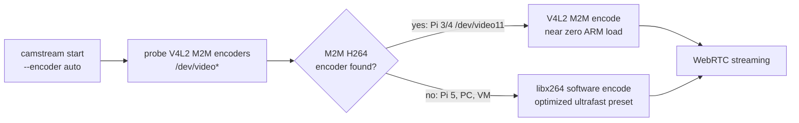

# Raspberry Pi guide

[camstream docs](README.md) / 14. Raspberry Pi guide &nbsp;·&nbsp; [README](../README.md)

camstream targets Raspberry Pi OS (Bookworm, Bullseye) on Pi 3, 4, 5 and Zero 2 W. 64 bit OS is strongly recommended: libx264 and OpenSSL packages are faster and fully optimized there.

## Architecture and hardware encoder differences

The Raspberry Pi hardware video encoding architecture differs between board generations:

- **Raspberry Pi 4 and 3**: Feature a dedicated VideoCore H.264 hardware encoder exposed as a V4L2 memory-to-memory (M2M) device (typically `/dev/video11`, `bcm2835-codec-encode`).
- **Raspberry Pi 5**: Upgrades the CPU to a quad-core ARM Cortex-A76 at 2.4 GHz, but removes the legacy VideoCore H.264 hardware encoder block. The Pi 5 CPU cores are exceptionally fast and encode 720p30 and 1080p30 H.264 video using software encoding (`libx264`) with minimal CPU utilization (around 15 to 25 percent of total CPU capacity).

camstream probes hardware capabilities dynamically:



When run with `--encoder auto` (the default) on a Raspberry Pi 5, camstream automatically detects that no V4L2 M2M encoder is present and selects `libx264` software encoding seamlessly without failing or crashing.

To explicitly select software encoding on Pi 5:

```bash
./build/camstream -s csi -W 1280 -H 720 -F 30 -e sw -b 2500
```

## Install and build

Install the required development libraries:

```bash
sudo apt update
sudo apt install -y build-essential libssl-dev libsrtp2-dev libx264-dev rpicam-apps
cd cam
make
```

Everything needed is available directly in the Raspberry Pi OS repositories. No third-party repositories, Docker, FFmpeg, or GStreamer are required at runtime.

## Camera sources

### Raspberry Pi Camera Module (CSI ribbon)

Modern Raspberry Pi OS (Bookworm) uses the `libcamera` / `rpicam` stack for CSI cameras (Camera Module v1, v2, v3, HQ Camera, Global Shutter Camera).

camstream provides two native methods to stream from a CSI camera without needing `v4l2loopback`:

#### 1. Built-in CSI source (`--source csi`)

camstream directly spawns `rpicam-vid` (or `libcamera-vid`) as a managed child process using `fork` and `execv`. The camera tool writes raw uncompressed YUV420 (`I420`) frames directly into an anonymous Unix pipe read by camstream:


Run camstream in CSI mode:

```bash
./build/camstream --source csi -W 1280 -H 720 -F 30 -e sw -b 2500
```

Key advantages of `--source csi`:
- **Zero kernel modules**: No `v4l2loopback` installation or configuration required.
- **Zero intermediary tools**: No FFmpeg, no GStreamer, no shell wrappers.
- **Clean lifecycle management**: camstream starts `rpicam-vid` on startup and gracefully stops it with `SIGTERM` when exiting.
- **Strict resolution alignment**: The camera capture resolution and encoder resolution are kept strictly identical, preventing frame mismatch errors.

If your camera binary is in a custom location, specify `--rpicam-bin`:

```bash
./build/camstream --source csi --rpicam-bin /usr/bin/rpicam-vid -W 1280 -H 720 -F 30
```

#### 2. Raw YUV420 standard input pipe (`--stdin-yuv420`)

You can also run `rpicam-vid` manually and pipe its raw YUV420 output directly into camstream via standard input:

```bash
rpicam-vid -t 0 -n --width 1280 --height 720 --framerate 30 --codec yuv420 -o - | \
    ./build/camstream --stdin-yuv420 -W 1280 -H 720 -F 30 -e sw -b 2500
```

camstream reads exact frame boundaries (`width * height * 3 / 2` bytes per frame) from standard input, tolerating partial reads and maintaining monotonic timestamps.

### USB webcam (V4L2)

Standard USB cameras connect through the V4L2 device subsystem:

```bash
ls -l /dev/video*
./build/camstream --source v4l2 -d /dev/video0 -W 1280 -H 720 -F 30
```

Ensure your user is in the `video` group:

```bash
sudo usermod -aG video $USER
```

### Synthetic test pattern

To test networking, WebRTC negotiation, and browser playback without any physical camera attached:

```bash
./build/camstream --test -W 640 -H 480 -F 30 -e sw
```

## CPU load reference

| Hardware | Source | Encoder | Resolution | CPU Load |
|---|---|---|---|---|
| Raspberry Pi 5 | CSI (`--source csi`) | `sw` (`libx264`) | 1280x720 @ 30 fps | ~20 percent across all cores |
| Raspberry Pi 5 | CSI (`--source csi`) | `sw` (`libx264`) | 1920x1080 @ 30 fps | ~45 percent across all cores |
| Raspberry Pi 4 | CSI (`--source csi`) | `hw` (`/dev/video11`) | 1280x720 @ 30 fps | ~15 percent of one core |
| Raspberry Pi 4 | USB (`--source v4l2`) | `sw` (`libx264`) | 640x480 @ 30 fps | ~50 percent of one core |
| Raspberry Pi 3 | USB (`--source v4l2`) | `hw` (`/dev/video11`) | 640x480 @ 25 fps | ~20 percent of one core |

Monitor running statistics via the `/status` JSON endpoint:

```bash
curl -s http://localhost:8080/status | jq .
```

## Tuning per model

| Model | Recommended invocation |
|---|---|
| Pi 5 | `./build/camstream -s csi -W 1280 -H 720 -F 30 -e sw -b 2500` |
| Pi 4 | `./build/camstream -s csi -W 1280 -H 720 -F 30 -e hw -b 3000` |
| Pi 3 | `./build/camstream -s v4l2 -d /dev/video0 -W 640 -H 480 -F 25 -e hw -b 1500` |
| Pi Zero 2 W | `./build/camstream -s v4l2 -d /dev/video0 -W 640 -H 480 -F 20 -e hw -b 1000` |

## LAN viewing from a browser

When camstream starts, it displays its local LAN IP address and HTTP port:

```text
camstream 2.0.0 ready [native backend - OpenSSL + libsrtp2]
open http://192.168.1.100:8080/   (wlan0)
udp media ports 50000-50007 (one per viewer, up to 8)
firewall: allow TCP 8080 and UDP 50000-50007
```

On any computer or mobile phone connected to the same LAN:
1. Open a web browser (Chrome, Firefox, Safari, Edge).
2. Navigate to `http://<pi-ip>:8080/` (for example, `http://192.168.1.100:8080/`).
3. The video stream plays immediately inside the HTML5 `<video>` element with sub-second glass-to-glass latency.
4. No browser plugins, cloud servers, or STUN/TURN services are needed on a local area network.

## Run as a systemd service

Create `/etc/systemd/system/camstream.service`:

```ini
[Unit]
Description=camstream WebRTC camera server
After=network-online.target
Wants=network-online.target

[Service]
ExecStart=/usr/local/bin/camstream --source csi --width 1280 --height 720 --fps 30 --encoder sw --bitrate 2500 --http-port 8080
Restart=always
RestartSec=3
User=pi
SupplementaryGroups=video
Nice=-5

[Install]
WantedBy=multi-user.target
```

Enable and start the service:

```bash
sudo cp build/camstream /usr/local/bin/
sudo systemctl daemon-reload
sudo systemctl enable --now camstream
journalctl -u camstream -f
```

## Common Pi specific issues

| Symptom | Cause | Fix |
|---|---|---|
| `neither 'rpicam-vid' nor 'libcamera-vid' was found` | Camera tools package not installed | Install official tools with `sudo apt install -y rpicam-apps` |
| `failed to initialize Raspberry Pi CSI camera source` | CSI ribbon cable detached or sensor busy | Verify ribbon connection with `rpicam-hello` and ensure no other process has opened the camera |
| `cannot open /dev/video0: Permission denied` | User not in video group | Run `sudo usermod -aG video $USER` and log back in |
| no M2M encoder found on Pi 5 | Pi 5 does not have V4L2 M2M hardware encoding | Normal behavior on Pi 5: camstream automatically uses `libx264` software encoding (`-e sw`) |
| video stutters on Pi 3 | Software encoder overload | Use `-e hw` with lower resolution and framerate (for example 640x480 at 25 fps) |
| session drops after 15 s idle log line | UDP media packets blocked by firewall | Ensure UDP ports 50000 to 50007 are open in firewall (`sudo ufw allow 50000:50007/udp`) |

---

| | | |
|---|---|---|
| **Previous**<br>[13. Two laptops, one cable](13_lan_two_laptops.md) | **Index**<br>[docs](README.md) | **Next**<br>[15. Optimization notes](15_optimization_notes.md) |
